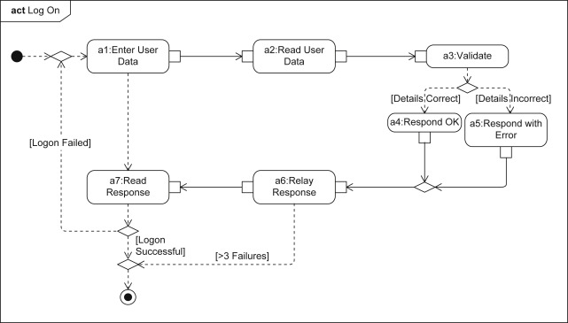

| Guide      | Tittle                                             |
| ---------- | -------------------------------------------------- |
| 06-152     | Introduction to UML Components and Common Elements |
| **06-153** | **Common UML Components: Frames**                  |
| 06-154     | Common UML Components: Classifiers                 |
| 06-155     | Common UML Components. Stereotypes                 |
| 06-156     | Common UML Components: Comments and Notes          |
| 06-157     | Common UML Components: Dependencies                |
| 06-158     | Common UML Components: Features and Properties     |
| 06-159     | Quiz:   Introduction to UML                        |

---

# 06-153: UML FRAMES

---

1. **Introduction to Frames**
   
   1. What are Frames? 
   2. Purpose and Benefits

2. **Frame Components and Structure** 
   
   1. Frame Header Elements
   2. Encapsulation Boundaries

3. **Standardised Naming Conventions** 
   
   1. Official UML Frame Mappings 
   2. Diagram Type Identifiers

4. **Implementation in Different Diagram Types**
   
   1. Use Case Diagram Frames 
   2. Class Diagram Frames 
   3. Activity Diagram Frames 
   4. Sequence Diagram Frames

5. **Practical Application** 
   
   1. Large System Management 
   2. Team Collaboration Benefits

6. **Frame Design Guidelines**

7. **BEst Practices - Tips**

---

## 1.     Introduction to Frames

## What FRAMES are

Frames in UML are **encapsulation containers** that provide contextual boundaries around diagram elements.

A frame **serves as:**

* #### An encapsulated container
* #### As a Visual Organiser
* #### Within defined boundaries
* #### With descriptive headers


Frames, as **labeled containers** that hold your UML diagrams, are similar to how you might label file folders in a filing cabinet.

Just as a labeled folder helps **you quickly identify its contents without opening it**, frames help you instantly understand what type of diagram you're looking at and what system or module it represents.

## Purpose


### Primary Functions

- **Instant Recognition**: Quickly identify diagram types without detailed analysis
- **Context Provision**: Understand which system or module the diagram represents
- **Professional Organization**: Maintain consistent documentation standards
- **Team Communication**: Facilitate clear understanding among team members

## Benefits

1. **Reduced Cognitive Load**: No need to analyze diagram content to understand its type
2. **Improved Navigation**: Easy to locate specific diagrams in large documentation sets
3. **Standardization**: Consistent approach across all project documentation
4. **Professional Presentation**: Clean, organised appearance for stakeholder presentations


---

## 2.     Frame Components and Structure

### *Frame Header Elements*

Every UML frame consists of **TWO** essential components:


#### Frame Border

- A rectangular boundary that encapsulates the entire diagram
- Clearly delineates what belongs to this specific model
- Provides visual separation from other documentation elements

#### Frame Header (Nameplate)

Located in the **top-left corner**, the header contains:

- **Diagram Type Abbreviation**: Standardized code identifying the UML diagram type
- **Diagram Name/Title**: Descriptive name indicating the specific system or module
- **Optional Additional Information**: Version numbers, dates, or other metadata

### ***Frame Header Standard Syntax***

```
[DiagramType] DiagramName [OptionalInfo]
```

```
UC SongRequest v1.2
```

- `UC` = Use Case Diagram
- `SongRequest` = Module/System Name
- `v1.2` = Version (optional)

---

## **3. Standardized Naming Conventions**
---
### *Official UML Frame Mappings*

The UML specification provides **standardised abbreviations for frame headers:**

| Diagram Type             | Abbreviation | Full Name                    |
| ------------------------ | ------------ | ---------------------------- |
| **Activity**             | `act`        | Activity Diagram             |
| **Class**                | `class`      | Class Diagram                |
| **Communication**        | `comm`       | Communication Diagram        |
| **Component**            | `comp`       | Component Diagram            |
| **Deployment**           | `depl`       | Deployment Diagram           |
| **Interaction Overview** | `io`         | Interaction Overview Diagram |
| **Object**               | `obj`        | Object Diagram               |
| **Package**              | `pkg`        | Package Diagram              |
| **Profile**              | `profile`    | Profile Diagram              |
| **Sequence**             | `seq` / `sd` | Sequence Diagram             |
| **State Machine**        | `stm`        | State Machine Diagram        |
| **Timing**               | `tim`        | Timing Diagram               |
| **Use Case**             | `uc`         | Use Case Diagram             |

---
### *Naming Best Practices*

#### For System Names

- Use **PascalCase** for multi-word names: `UserManagement`, `PaymentProcessor`
- Keep names **concise but descriptive**: `OrderSystem` rather than `OnlineOrderManagementSystem`
- Use **consistent terminology** across all diagrams

#### Complete Examples

```
uc UserAuthentication

class PaymentProcessor

act OrderFulfillment

seq DatabaseConnection

stm ShoppingCart

depl ProductionEnvironment
```

---

## 4. Implementation in Different Diagram Types

---
### *Use Case Diagram Frames*

#### **Purpose**

Identify actors and their interactions with system functionality

#### **Frame Example**
 

#### **When to Use**

- Planning user interaction requirements
- Documenting system boundaries and external actors
- Communicating functionality to non-technical stakeholders

---
### ***Class Diagram Frames***

#### **Purpose**
Document object structure and relationships

#### **Frame Example**

#### **When to Use**

- Database design and modeling
- Object-oriented system architecture
- Code generation planning

---

### *Activity Diagram Frames*

#### **Purpose**

Map business processes and workflow logic

#### **Frame Example**


#### **When to Use**

- Business process documentation
- Workflow optimization
- System behavior modeling

---

### *Sequence Diagram Frames*

#### **Purpose**
Document message flow between system components
#### **Frame Example**
Notice that `sd` abbr. is also utilised:


#### **When to Use**

- API design and documentation
- System integration planning
- Debugging complex interactions

---

## 5.     Practical Application
---
### *Large System Management*

#### Challenge:         Documentation Overload

In enterprise systems, you might have **50+ UML diagrams** across multiple modules.

Without frames, finding the right diagram becomes a time-consuming hunt.

#### Solution:            Systematic Frame Usage

```
uc CustomerPortal_Authentication
uc CustomerPortal_Dashboard
uc CustomerPortal_Billing

class CustomerPortal_UserModel
class CustomerPortal_PaymentModel
class CustomerPortal_ReportModel

seq CustomerPortal_LoginFlow
seq CustomerPortal_PaymentFlow
seq CustomerPortal_ReportGeneration
```

**Result** -> Instant recognition and logical grouping of related diagrams.

---

### *Team Collaboration Benefits*

#### Scenario: New Team Member Onboarding

When a new developer joins a team:
#### 😫 **Without Frames**

- Must analyse each diagram to understand its purpose
- Confusion about which diagrams relate to which modules
- Time wasted on clarification meetings

#### 🗿 **With Frames**

- Immediate understanding of diagram types and scope
- Clear module boundaries and relationships
- Self-documenting system architecture

#### Cross-Team Communication

* **Business Analysts** can quickly identify use case diagrams (`uc`).
* **Database Architects** can focus on class diagrams (`class`).
* **System Administrators** can locate deployment diagrams (`depl`)

---

# 6.     Frame Design Guidelines

| Aspect         | Guideline           | Purpose            |
| -------------- | ------------------- | ------------------ |
| **Padding**    | 10-15px minimum     | Visual clarity     |
| **Header**     | Top-left placement  | UML standard       |
| **Content**    | Single logical unit | Clear organization |
| **Boundaries** | No overlap          | Clean separation   |


## ➜ Visual Design Principles

---
### ➡️ ***Frame Sizing***

##### **Minimum Padding**

- Leave at least 10-15 pixels between frame border and diagram content
- Ensures visual breathing room and professional appearance

##### **Proportional Scaling**

- Frame should scale with diagram complexity
- More complex diagrams require larger frames for clarity

##### **Consistent Margins**

- Maintain uniform spacing across all diagrams
- Creates cohesive documentation suite

---
### ➡️ ***Header Placement***

##### **Always Top-Left**

- Standard UML convention for frame headers
- Ensures predictable information location

##### **Clear Font**

- Use readable typeface, typically same as diagram text
- Maintains visual consistency throughout documentation

##### **Appropriate Size**

- Header should be prominent but not overwhelming
- Balance visibility with content space optimisation
---

## ➜     Content Organisation
---
### ➡️ ***What Goes Inside Frames***

#### ✅ **INCLUDE**

- All primary diagram elements
- Related annotations and notes
- Legend or key information specific to this diagram

#### ❌ **AVOID**

- General project information (use separate title blocks)
- Unrelated diagram elements
- Excessive white space that doesn't serve readability

---
### ➡️ ***Frame Boundaries***

##### 🗿  **One Purpose per Frame**

- Each frame should represent a single logical unit
- Maintains clear separation of concerns

##### 🗿  **Clear Scope**

- Everything inside the frame should relate to the named system/module
- Prevents confusion about element relationships

##### 🗿  **No Overlapping**

- Frames should not contain elements from other logical units
- Ensures clean architectural boundaries

---

## 7.    🗿  Best Practices - More TIps

---

### ***Implementation Checklist***
---
#### **Before Creating Diagrams:**

- [ ] Establish naming conventions for your project
- [ ] Create frame header templates
- [ ] Define standard frame sizes for different diagram types
---
#### **During Diagram Creation:**

- [ ] Add frame immediately after creating new diagram
- [ ] Use appropriate diagram type abbreviation
- [ ] Include descriptive but concise system/module name
- [ ] Ensure all relevant content fits within frame boundaries
---
#### **Quality Assurance:**

- [ ] Verify frame headers match diagram content
- [ ] Check consistency across all project diagrams
- [ ] Review frame naming with team members
- [ ] Update frames when diagram scope changes

---

### ***Professional Standards***

1. **Consistency is King**: Use the same frame style throughout all project documentation

2. **Meaningful Names**: Frame titles should immediately convey the diagram's purpose

3. **Version Control**: Include version information in frames when documenting evolving systems

4. **Regular Updates**: Keep frame information current as systems change

---
### ***Common Mistakes to Avoid***

❌ **Inconsistent Abbreviations**: Mixing `UC` and `UseCase` in different diagrams

❌ **Overly Long Names**: `uc CompleteUserAuthenticationAndAuthorizationSystem`

❌ **Missing Frames**: Having some diagrams with frames and others without

❌ **Wrong Diagram Types**: Using `class` abbreviation for an activity diagram

---
### ***More Tips***

🗿 **Frame Templates**: Create reusable frame templates in your UML tool

🗿 **Colour Coding**: Use subtle background colours to distinguish diagram types

🗿 **Nested Systems**: For complex systems, use hierarchical naming like `CustomerPortal_Auth_LoginFlow`

🗿 **Documentation Integration**: Ensure frame names match corresponding technical documentation sections
