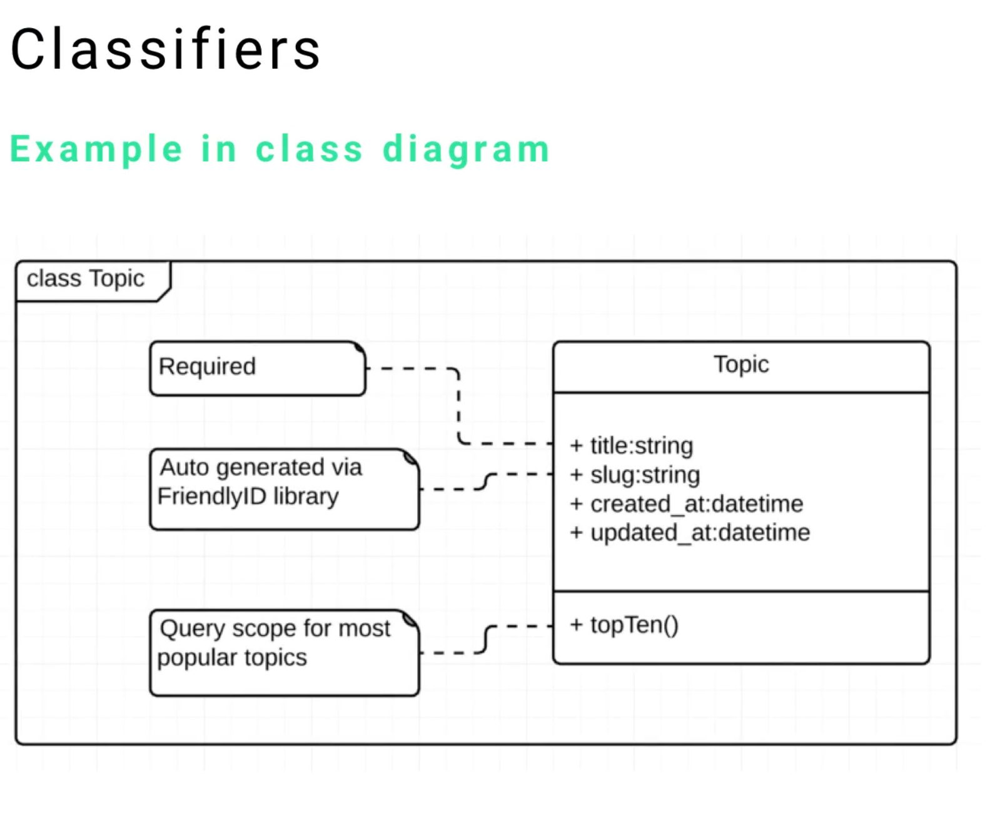

| Guide  | Tittle                                             |
| ------ | -------------------------------------------------- |
| 06-152 | Introduction to UML Components and Common Elements |
| 06-153 | Common UML Components: Frames                      |
| **06-154** | **Common UML Components: Classifiers**                 |
| 06-155 | Common UML Components. Stereotypes                 |
| 06-156 | Common UML Components: Comments and Notes          |
| 06-157 | Common UML Components: Dependencies                |
| 06-158 | Common UML Components: Features and Properties     |
| 06-159 | Quiz:   Introduction to UML                        |

---

# 06-154: UML   CLASSIFIERS

1. What Classifiers are
2. Abstract Nature of Classifiers
3. Universal Application Across Diagrams
4. Key Characteristics and Functions
5. Common Usage Examples
6. Classifiers vs Classes - Key Distinction
7. Implementation Guidelines

---
## ***1.    What Classifiers Are***

  Classifiers are fundamental UML components that serve as **identification mechanisms for various elements within UML diagrams**.

  > We refer a class, an object, a component, or a deployment node as classifiers in UML since they define a common set of properties.   
  > 
  > We are able to design object diagrams by instantiating classifiers.

  
They provide **a standardised naming convention** that **enables clear communication** between designers, developers, and stakeholders throughout the software development life-cycle.

The primary purpose of classifiers is exactly what their name implies - they **classify items**.

This **high-level categorisation** system:

* #### **ensures consistency and clarity** across all UML documentation
* #### **serves** as a foundation **for understanding the structure and relationships within a system**.

---
## 2.    Abstract Nature of Classifiers

One of the most important concepts to understand about classifiers is their **abstract nature**.

This means:

- **You won't implement a classifier directly** in code
- Classifiers are more of a **category or template** for components
- They serve as a **conceptual framework** rather than concrete implementations
- This abstract characteristic often trips up newcomers to UML

---
## 3.    Universal Application Across Diagrams

Classifiers are utilised in virtually every type of UML diagram, making them one of the most pervasive elements in UML modeling.

They appear in:

- **Class Diagrams** - Naming classes and their relationships
- **Use Case Diagrams** - Identifying actors and use cases
- **Sequence Diagrams** - Labeling objects and lifelines
- **Activity Diagrams** - Naming activities and decision points
- **Component Diagrams** - Identifying system components
- **Deployment Diagrams** - Naming hardware and software nodes
- **State Machine Diagrams** - Labeling states and transitions
- **Communication Diagrams** - Identifying participating objects

---

## 4.    Key Characteristics and Functions
---

### ***Standardisation***

Classifiers provide a **unified naming approach** across all UML elements, ensuring consistency in documentation and communication.

### *Identification*

They serve as **unique identifiers** for different components, making it easier to reference and discuss specific elements during development.

### *Communication*

Classifiers act as a **common language** between team members, facilitating better understanding and collaboration.

### *Documentation*

They provide **clear labeling** that makes UML diagrams self-documenting and easier to maintain over time.

---

## 5.    Common Usage Examples
---
### *Class Diagrams*

In a class diagram, the classifier appears as the **class name** at the top of each class box.

For example, if you have a class representing a blog system, "Topic" would be the classifier for that particular class.

--- 
### *Use Case Diagrams*

When creating use case diagrams, classifiers identify:

  
- **Actor names** (e.g., "User", "Administrator")
- **Use case names** (e.g., "Login", "Create Post", "Manage Content")

---
### *Object Diagrams*

Classifiers in object diagrams represent the **type or class** that each object instance belongs to.
  
---

## 6.    Classifiers vs Classes

A common source of confusion is the relationship between **classifiers** and **classes**:

### Classifier

- A **naming mechanism** used across all UML diagrams
- An **abstract concept** for identification
- **Not specific** to class diagrams only
- Used for **categorisation purposes**

### Class

  
- A **specific element** in class diagrams
- Representts a **concrete blueprint** for objects
- Contains **attributes and methods**
- **Implementation-focused**

  
> **Important Note**: A class in a class diagram **has** a classifier (its name), but the classifier itself is not the same as the class. The classifier is simply the identification label.
---

## 7.    Implementation Guidelines
---
### *Naming Conventions*

- Use **clear, descriptive names** that reflect the element's purpose
- Follow **consistent naming patterns** throughout your project
- Avoid **abbreviations** unless they are widely understood
- Use **meaningful terminology** relevant to the problem domain

### *Consistency*

- Maintain **uniform naming styles** across all diagrams
- Ensure **alignment** between different diagram types
- Use the **same classifier** for the same concept across different views

### *Documentation*

- **Document classifier meanings** when they might be ambiguous
- Provide **context** for domain-specific terminology
- Maintain a **glossary** of classifiers used in complex projects

## Best Practices - Tips
---
### 🎨 Design Phase

- **Plan your classifier naming strategy** early in the project
- **Involve stakeholders** in defining meaningful names
- **Consider future maintenance** when choosing names

### </> Implementation

- **Review classifier consistency** regularly across diagrams
- **Refactor names** when requirements change
- **Validate understanding** with team members

### 📝 Documentation

- **Keep a master list** of all classifiers used
- **Update documentation** when classifiers change
- **Provide context** for technical or domain-specific terms

### ❌ Common Pitfalls to AVOID

- Don't confuse classifiers with the actual implementation elements
- Avoid using the same name for different concepts
- Don't change classifier names without updating all related diagrams
- Resist the temptation to use overly technical jargon

---