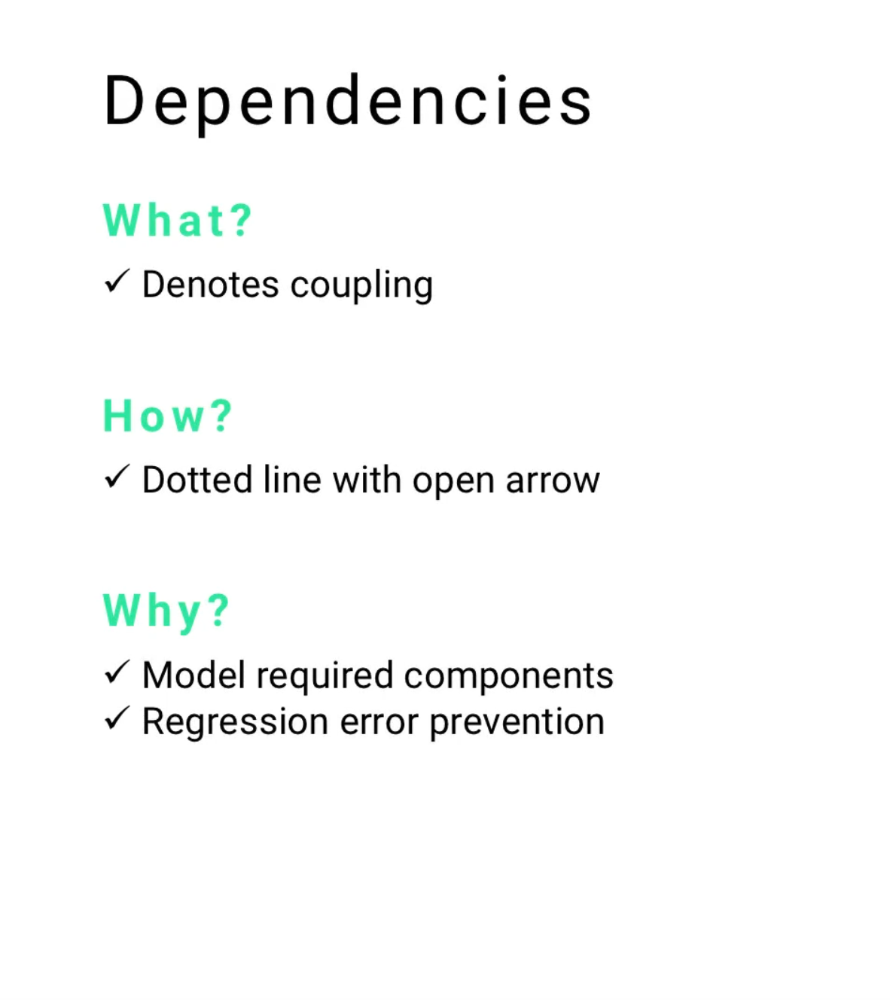
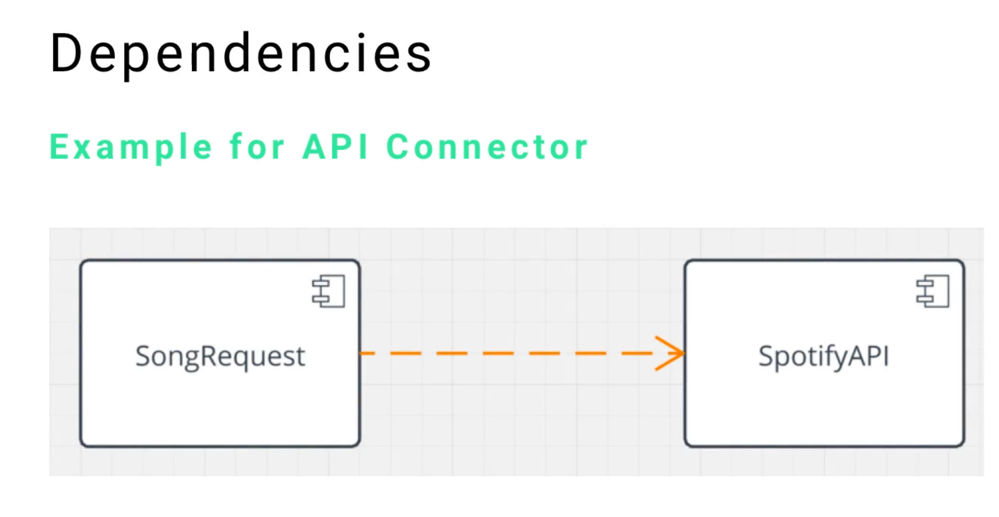

| Guide      | Tittle                                             |
| ---------- | -------------------------------------------------- |
| 06-152     | Introduction to UML Components and Common Elements |
| 06-153     | Common UML Components: Frames                      |
| 06-154     | Common UML Components: Classifiers                 |
| 06-155     | Common UML Components. Stereotypes                 |
| 06-156     | Common UML Components: Comments and Notes          |
| **06-157** | **Common UML Components: Dependencies**            |
| 06-158     | Common UML Components: Features and Properties     |
| 06-159     | Quiz:   Introduction to UML                        |

---

# 06-157: UML      DEPENDENCIES
---
### 1. What Dependencies Means

- **1.1** Definition and Core Concepts
- **1.2** The Role of Coupling in Software Design
- **1.3** Dependencies as System Architecture Indicators

### 2. Understanding Coupling

- **2.1** Coupling Fundamentals
- **2.2** Types of Coupling
- **2.3** Coupling Strength Assessment
- **2.4** Impact on System Maintainability

### 3. Visual Representation and Notation

- **3.1** Standard UML Notation
- **3.2** Arrow Direction and Meaning
- **3.3** Line Styles and Variations
- **3.4** Stereotyped Dependencies

### 4. Types of UML Dependencies

- **4.1** Use Dependencies
- **4.2** Abstraction Dependencies
- **4.3** Permission Dependencies
- **4.4** Realization Dependencies
- **4.5** Substitution Dependencies

### 5. Dependency Applications Across Diagrams

- **5.1** Class Diagrams
- **5.2** Component Diagrams
- **5.3** Package Diagrams
- **5.4** Deployment Diagrams
- **5.5** Use Case Diagrams

### 6. Practical Examples and Case Studies

- **6.1** API Integration Dependencies
- **6.2** Library and Framework Dependencies
- **6.3** Database Connection Dependencies
- **6.4** Service Layer Dependencies

### 7. Dependency Analysis and Management

- **7.1** Identifying Critical Dependencies
- **7.2** Dependency Impact Assessment
- **7.3** Reducing Unnecessary Coupling
- **7.4** Refactoring Strategies

### 8. Best Practices and Design Patterns

- **8.1** Dependency Inversion Principle
- **8.2** Loose Coupling Strategies
- **8.3** Interface-Based Dependencies
- **8.4** Dependency Injection Patterns

### 9. Common Anti-Patterns and Pitfalls

- **9.1** Circular Dependencies
- **9.2** Over-Coupling Issues
- **9.3** Hidden Dependencies
- **9.4** Transitive Dependency Problems

### 10. Tools and Techniques for Dependency Management

- **10.1** Static Analysis Tools
- **10.2** Dependency Visualization
- **10.3** Impact Analysis Methods
- **10.4** Automated Dependency Tracking

---


## ***1.     What Dependencies Means***
---
### 1.1     Definition and Core Concepts

A UML **dependency** is a relationship that indicates one element (the client) relies on another element (the supplier) for its proper functioning.

Dependencies **represent the most fundamental form of relationship in UML**, denoting that changes to the supplier may affect the client.

The essence of dependencies lies in **coupling** - the degree to which one component needs another component to function correctly. Understanding dependencies is crucial for:

- **System architecture comprehension**
- **Impact analysis** during changes
- **Risk assessment** for modifications
- **Maintenance planning** and resource allocation



---
### 1.2     The Role of Coupling in Software Design

Coupling describes the **interdependence between software modules or components**. In UML dependencies:

- #### **High coupling** = Strong dependency, difficult to modify independently
- #### **Low coupling** = Weak dependency, easier to maintain and modify
- #### **No coupling** = Independent components, maximum flexibility

The goal in software design is typically to achieve **low coupling** **while maintaining necessary functional relationships**.

---
### 1.3     Dependencies as System Architecture Indicators

Dependencies serve as architectural indicators that reveal:

- **Critical system paths** that cannot be broken
- **Single points of failure** that could crash the system
- **Integration complexity** between components
- **Testing dependencies** and required test sequences
- **Deployment order** requirements for system components

---


## ***2.     Understanding Coupling***
---
### 2.1     Coupling Fundamentals

Coupling in software systems manifests through various mechanisms:

- **Data coupling** - Components share data structures
- **Control coupling** - One component controls another's execution
- **Common coupling** - Components share global data
- **Content coupling** - One component modifies another's internal data
- **Message coupling** - Components communicate through well-defined interfaces

---
### 2.2     Types of Coupling

| Coupling Type | Strength   | Description               | UML Representation                      |
| ------------- | ---------- | ------------------------- | --------------------------------------- |
| **Data**      | Low        | Parameter passing only    | Simple dependency                       |
| **Stamp**     | Low-Medium | Data structure sharing    | Dependency with stereotype              |
| **Control**   | Medium     | Control flow dependency   | Dependency with control stereotype      |
| **Common**    | High       | Global data sharing       | Multiple dependencies to shared element |
| **Content**   | Very High  | Internal structure access | Strong dependency relationship          |

---
### 2.3     Coupling Strength Assessment

Factors that determine coupling strength:

- **Number of connection points** between components
- **Type of data shared** (primitive vs. complex)
- **Frequency of interaction** between components
- **Degree of knowledge** one component has about another
- **Stability of the interface** between components

---
### 2.4     Impact on System Maintainability

Strong coupling negatively impacts:

- **Modifiability** - Changes cascade through dependent components
- **Testability** - Difficult to test components in isolation
- **Reusability** - Tightly coupled components cannot be easily reused
- **Understandability** - Complex interdependencies obscure system behavior

---


## ***3.     Visual Representation and Notation***
---
### 3.1     Standard UML Notation

Dependencies are represented by:

```
Client -----> Supplier
(dashed line with open arrowhead)
```



#### **Visual elements**

- **Line style**: Dashed or dotted line
- **Arrowhead**: Open triangle pointing to the supplier
- **Direction**: From client (dependent) to supplier (dependency target)
- **Optional labels**: Dependency name or stereotype

---
### 3.2     Arrow Direction and Meaning

The arrow direction is crucial for understanding the dependency relationship:

```
A -----> B
```

#### **Interpretation**: "A depends on B"

- A is the **client** (the dependent element)
- B is the **supplier** (the element being depended upon)
- Changes to B may affect A
- A cannot function properly without B

---
### 3.3     Line Styles and Variations

Different line styles can indicate dependency characteristics:

- **Standard dashed line** - General dependency
- **Dotted line with stereotype** - Specific dependency type
- **Colored lines** - Priority or category indication (tool-specific)
- **Thick/thin variations** - Strength indication (tool-specific)

---
### 3.4     Stereotyped Dependencies

Common dependency stereotypes include:

- **«use»** - Client uses services of supplier
- **«call»** - Client calls operations on supplier
- **«create»** - Client creates instances of supplier
- **«import»** - Client imports supplier's namespace
- **«access»** - Client accesses supplier's public features
- **«instantiate»** - Client creates instances of supplier class

---


## ***4.     Types of UML Dependencies***
---
### 4.1     Use Dependencies

**Use dependencies** indicate that one element requires another for its implementation or operation.

```
Controller -----> Service
«use»
```

#### **Characteristic**

- Most common dependency type
- Indicates operational reliance
- Often represents method calls or service usage

---
### 4.2     Abstraction Dependencies

**Abstraction dependencies** relate elements at different levels of abstraction.

#### **Subtypes**

- **«derive»** - Derived element computed from source
- **«trace»** - Informal correspondence between elements
- **«refine»** - Refined element adds detail to source


---
### 4.3     Permission Dependencies

**Permission dependencies** grant access rights to elements.

#### **Subtypes**

- **«access»** - Public feature access
- **«import»** - Namespace importation
- **«friend»** - Special access privileges (It's a C++ concept)

---
### 4.4     Realization Dependencies

**Realization dependencies** indicate implementation relationships.

```
ConcreteClass -----> Interface
«realize»
```

**Usage:** Classes implementing interfaces or components realizing specifications

---
### 4.5     Substitution Dependencies

**Substitution dependencies** indicate that one element can be substituted for another.

```
SubClass -----> SuperClass
«substitute»
```

**Usage:** Polymorphic relationships and design pattern implementations

---


## ***5.     Dependency Applications Across Diagrams***
---
### 5.1 Class Diagrams

In class diagrams, dependencies represent:

- **Method parameter types** used by a class
- **Local variable types** within methods
- **Exception types** thrown by methods
- **Utility class usage** for operations

#### **Example**

```
┌─────────────────┐     «use»      ┌─────────────────┐
│ OrderProcessor  │ ────────────>  │ PaymentService  │
├─────────────────┤                ├─────────────────┤
│ + processOrder()│                │ + charge()      │
|                 |                │ + refund()      │
└─────────────────┘                └─────────────────┘
```

---
### 5.2 Component Diagrams

Component dependencies show:

- **Service consumption** between components
- **Interface usage** requirements
- **Library dependencies** for functionality
- **Framework requirements** for operation

---
### 5.3 Package Diagrams

Package dependencies indicate:

- **Import relationships** between packages
- **Access permissions** across package boundaries
- **Compilation dependencies** in build processes
- **Deployment sequence** requirements

---
### 5.4 Deployment Diagrams

Deployment dependencies represent:

- **Hardware requirements** for software components
- **Network connectivity** needs between nodes
- **Service dependencies** across deployment units
- **Infrastructure requirements** for applications

---
### 5.5 Use Case Diagrams

Use case dependencies show:

- **«include»** relationships for mandatory sub-use cases
- **«extend»** relationships for optional extensions
- **Actor dependencies** on system capabilities
- **System boundary** crossing requirements

---

## ***6.     Practical Examples and Case Studies***
---
### 6.1 API Integration Dependencies

#### Music Request System with Spotify Integration

```
                    ┌─────────────────────┐
                    │   Client App        │
                    │   (Music Player)    │
                    └─────────────────────┘
                             │
                             │ «submits»
                             ▼
┌─────────────────────┐               ┌─────────────────────┐
│   SongRequest       │ ─────────────>│   SpotifyAPI        │
├─────────────────────┤    «use»      ├─────────────────────┤
│ - title: String     │               │ + authenticate()    │
│ - artist: String    │               │ + search(query)     │
│ - duration: Integer │               │ + getTrack(id)      │
│ - requestId: UUID   │               │ + getAlbum(id)      │
├─────────────────────┤               │ + addToQueue(id)    │
│ + submit()          │               │ + getUserPlaylists()│
│ + validate()        │               │ + createPlaylist()  │
│ + toSpotifyQuery()  │               └─────────────────────┘
│ + retry()           │                         │
└─────────────────────┘                         │ «depends on»
            │                                   ▼
            │ «fallback»                ┌─────────────────────┐
            ▼                          │   Spotify Service   │
┌─────────────────────┐                ├─────────────────────┤
│  AlternativeAPI     │                │ - Web API           │
├─────────────────────┤                │ - Authentication    │
│ + searchYouTube()   │                │ - Rate Limiting     │
│ + searchAppleMusic()│                │ - Error Handling    │
│ + searchLocal()     │                └─────────────────────┘
└─────────────────────┘
```

### Dependency Analysis

**SongRequest cannot function without SpotifyAPI** - this creates critical dependency risks:

| Risk Factor        | Impact Level | Mitigation Strategy                     |
| ------------------ | ------------ | --------------------------------------- |
| **API Downtime**   | High         | Implement fallback services             |
| **Rate Limiting**  | Medium       | Add request queuing and throttling      |
| **Schema Changes** | High         | Use adapter pattern and versioning      |
| **Authentication** | Critical     | Implement token refresh and backup auth |

### Coupling Assessment

#### **Tight Coupling Indicators:**

- Direct API method calls in business logic
- Spotify-specific data formats in core classes
- No abstraction layer between request and external service
- Immediate failure when API is unavailable

#### **Recommended Decoupling Strategies**

1. **Interface Abstraction**
```
MusicService Interface
├── SpotifyService (primary)
├── AppleMusicService (fallback)
└── YouTubeService (fallback)
```

2. **Adapter Pattern**
```
SongRequest → MusicAdapter → [SpotifyAPI | AlternativeAPI]
```

3. **Circuit Breaker Pattern**
```
SongRequest → CircuitBreaker → SpotifyAPI
```

### Enhanced Architecture Design

#### **Problems with Current Design:**

- **Single Point of Failure**: No fallback mechanisms
- **Vendor Lock-in**: Spotify-specific implementation
- **Error Propagation**: API failures break entire request flow
- **Testing Complexity**: Cannot unit test without external API

#### **Improved Design Benefits:**

- **Resilience**: Multiple music service providers
- **Flexibility**: Easy to add new music services
- **Testability**: Mock interfaces for unit testing
- **Maintainability**: Changes isolated to specific adapters


### Implementation Recommendations

#### **Immediate Actions**

1. Extract `IMusicService` interface
2. Implement retry logic with exponential backoff
3. Add comprehensive error handling and logging
4. Create mock service for testing

#### **Long-term Improvements**

1. Implement multiple music service providers
2. Add service health monitoring
3. Implement request caching for frequently accessed content
4. Create service discovery mechanism

---

_This dependency pattern demonstrates the challenges of external API integration and the importance of designing resilient, loosely-coupled systems that can handle external service failures gracefully._

---

### 6.2 Library and Framework Dependencies

_This pattern illustrates how modern applications depend on frameworks and libraries, showing both the benefits of rapid development and the architectural considerations for managing external dependencies._

```
                    ┌─────────────────────┐
                    │   Application       │
                    │   Components        │
                    └─────────────────────┘
                             │
                             │ «depends on»
                             ▼
┌─────────────────────┐               ┌─────────────────────┐
│   WebController     │ ─────────────>│  Spring Framework   │
├─────────────────────┤   «import»    ├─────────────────────┤
│ @RestController     │               │ @RestController     │
│ @RequestMapping     │               │ @RequestMapping     │
│                     │               │ @GetMapping         │
│ + getUserById()     │               │ @PostMapping        │
│ + createUser()      │               │ ResponseEntity<T>   │
│ + updateUser()      │               │ RequestBody         │
│ + deleteUser()      │               │ PathVariable        │
└─────────────────────┘               └─────────────────────┘
            │                                   │
            │ «uses»                           │ «provides»
            ▼                                   ▼
┌─────────────────────┐               ┌─────────────────────┐
│   UserService       │ ─────────────>│  Spring Core        │
├─────────────────────┤   «inject»    ├─────────────────────┤
│ @Service            │               │ @Component          │
│ @Autowired          │               │ @Service            │
│                     │               │ @Repository         │
│ + findUser()        │               │ ApplicationContext  │
│ + saveUser()        │               │ BeanFactory         │
└─────────────────────┘               │ Dependency Injection│
            │                         └─────────────────────┘
            │ «uses»                            │
            ▼                                   │ «built on»
┌─────────────────────┐                       ▼
│   External Library  │               ┌─────────────────────┐
├─────────────────────┤               │   Java Platform     │
│ Jackson JSON        │               ├─────────────────────┤
│ Hibernate ORM       │               │ JVM Runtime         │
│ Apache Commons      │               │ Standard Libraries  │
│ SLF4J Logging       │               │ Reflection API      │
└─────────────────────┘               └─────────────────────┘
```

### Framework Dependency Layers

#### **Application Layer Dependencies:**

- **WebController** → **Spring MVC** (Web tier annotations and utilities)
- **UserService** → **Spring Core** (Dependency injection and lifecycle management)
- **External Libraries** → **Specific functionalities** (JSON, ORM, logging)

### Dependency Analysis

|Component|Framework/Library|Dependency Type|Coupling Level|
|---|---|---|---|
|**Controller**|Spring MVC|Annotation-based|Medium|
|**Service**|Spring Core|Injection-based|Low|
|**Data Layer**|Hibernate|Interface-based|Medium|
|**Utilities**|Apache Commons|Method calls|High|

### Framework Benefits vs Trade-offs

#### **Benefits**

- **Rapid Development**: Pre-built components and patterns
- **Convention over Configuration**: Reduced boilerplate code
- **Ecosystem Integration**: Compatible libraries and tools
- **Community Support**: Documentation and best practices

#### **Trade-offs**

- **Framework Lock-in**: Migration complexity increases
- **Learning Curve**: Framework-specific knowledge required
- **Version Dependencies**: Compatibility constraints
- **Performance Overhead**: Additional abstraction layers

#### Dependency Management Strategies

1. **Interface Abstraction**: Minimize direct framework coupling
2. **Facade Pattern**: Wrap framework-specific functionality
3. **Configuration Externalization**: Reduce hard-coded dependencies
4. **Modular Architecture**: Isolate framework dependencies by layer


---
### 6.3 Database Connection Dependencies
_This pattern demonstrates how repository pattern manages database dependencies while maintaining loose coupling through interface abstraction._

```
                    ┌─────────────────────┐
                    │   Application       │
                    │   Layer             │
                    └─────────────────────┘
                             │
                             │ «depends on»
                             ▼
┌─────────────────────┐               ┌─────────────────────┐
│   UserRepository    │ ─────────────>│  DatabaseDriver     │
├─────────────────────┤    «use»      ├─────────────────────┤
│ + findById(id)      │               │ + connect()         │
│ + findByEmail()     │               │ + executeQuery()    │
│ + save(user)        │               │ + executeUpdate()   │
│ + update(user)      │               │ + beginTransaction()│
│ + delete(id)        │               │ + commit()          │
│ + findAll()         │               │ + rollback()        │
└─────────────────────┘               │ + disconnect()      │
            │                         └─────────────────────┘
            │ «implements»                        │
            ▼                                     │ «abstracts»
┌─────────────────────┐                         ▼
│   IUserRepository   │               ┌─────────────────────┐
├─────────────────────┤               │  Connection Pool    │
│ + findById(id)      │               ├─────────────────────┤
│ + save(user)        │               │ + getConnection()   │
│ + delete(id)        │               │ + releaseConnection │
└─────────────────────┘               │ + getActiveCount()  │
                                      └─────────────────────┘
```

### Dependency Analysis

#### **Repository Pattern Implementation:**

- **UserRepository** depends on **DatabaseDriver** for data persistence
- **Interface abstraction** reduces direct coupling to specific database implementations
- **Connection pooling** manages database resource efficiency

### Dependency Types

| Relationship               | Type           | Description                 |
| -------------------------- | -------------- | --------------------------- |
| **Repository → Driver**    | Use Dependency | Runtime database operations |
| **Repository → Interface** | Realization    | Contract implementation     |
| **Driver → Pool**          | Abstraction    | Resource management layer   |

### Coupling Characteristics

**Tight Coupling**: Repository methods directly invoke driver operations  
**Loose Coupling**: Interface abstraction allows driver substitution  
**Resource Dependency**: Connection pool manages shared database resources

### Benefits of This Pattern

- **Testability**: Interface allows mock implementations
- **Flexibility**: Easy database driver switching
- **Performance**: Connection pooling reduces overhead
- **Maintainability**: Clear separation of concerns

---
### 6.4 Service Layer Dependencies
_This service layer architecture demonstrates a typical microservices dependency pattern where a central orchestrator coordinates specialized services._

```
                    ┌─────────────────────┐
                    │   OrderService      │
                    ├─────────────────────┤
                    │ + createOrder()     │
                    │ + validateOrder()   │
                    └─────────────────────┘
                             │
                             │ «orchestrates»
                             │
            ┌────────────────┼────────────────┐
            │                │                │
            │ «use»          │ «call»         │ «use»
            ▼                ▼                ▼
┌─────────────────┐ ┌─────────────────┐ ┌─────────────────┐
│ InventoryService│ │ PaymentService  │ │ NotificationSvc │
├─────────────────┤ ├─────────────────┤ ├─────────────────┤
│ + checkStock()  │ │ + processPayment│ │ + sendEmail()   │
│ + reserveItems()│ │ + validateCard()│ │ + sendSMS()     │
│ + updateStock() │ │ + refundPayment │ │ + logActivity() │
└─────────────────┘ └─────────────────┘ └─────────────────┘
```

### Key Dependency Relationships

**OrderService** acts as the **orchestrator** that coordinates multiple services:

- **InventoryService**: Manages stock validation and reservation
- **PaymentService**: Handles payment processing and validation
- **NotificationService**: Manages customer communications

### Dependency Flow Analysis

1. **Primary Flow**: OrderService → PaymentService (critical path)
2. **Support Flow**: OrderService → InventoryService (validation)
3. **Notification Flow**: OrderService → NotificationService (communication)

### Coupling Assessment

|Service|Coupling Level|Justification|
|---|---|---|
|**Payment**|High|Critical business operation|
|**Inventory**|Medium|Stock validation required|
|**Notification**|Low|Non-blocking operation|

---


## ***7.     Dependency Analysis and Management***
---
### 7.1    Identifying Critical Dependencies

#### **Critical dependency indicators**

- **Single points of failure** - Components with no alternatives
- **High frequency usage** - Components called repeatedly
- **Cross-oundary dependencies** - Dependencies spanning architectural layers
- **External service dependencies** - Third-party service integrations

#### **Analysis techniques**

- **Dependency mapping** - Visual representation of all dependencies
- **Impact analysis** - Assessment of change ripple effects
- **Criticality scoring** - Ranking dependencies by importance
- **Failure mode analysis** - Identifying potential failure scenarios

---
### 7.2 Dependency Impact Assessment

#### **Assessment criteria**

- **Change frequency** of supplier components
- **Stability** of supplier interfaces
- **Number of clients** affected by supplier changes
- **Cost of modification** when dependencies break
- **Alternative options** available for replacement

#### **Impact levels**

- **High impact** - Mission-critical dependencies with no alternatives
- **Medium impact** - Important dependencies with difficult workarounds
- **Low impact** - Convenience dependencies with easy alternatives

---
### 7.3 Reducing Unnecessary Coupling

#### **Strategies for coupling reduction**

1. **Interface abstraction** - Depend on interfaces, not implementations
2. **Dependency injection** - Externalize dependency creation
3. **Event-driven architecture** - Replace direct calls with events
4. **Service abstraction** - Use service layers to hide implementation details
5. **Configuration externalization** - Move dependencies to configuration

### 7.4 Refactoring Strategies

#### **Common refactoring patterns**

- **Extract Interface** - Create abstractions for concrete dependencies
- **Introduce Service Layer** - Add indirection between components
- **Replace Inheritance with Delegation** - Reduce coupling through composition
- **Move Method** - Relocate functionality to reduce dependencies
- **Extract Component** - Separate concerns to minimize coupling

---


## _**8. Best Practices and Design Patterns**_
---

### 8.1 Dependency Inversion Principle

#### **Principle statement**--> "Depend upon abstractions, not concretions"
#### **Implementation**

```
┌─────────────────┐               ┌─────────────────┐
│ HighLevelModule │ ─────────────>│ <<interface>>   │
│                 │     «use»     │ AbstractService │
└─────────────────┘               └─────────────────┘
                                           ▲
                                           │ «implement»
                                           │
                                  ┌─────────────────┐
                                  │ ConcreteService │
                                  └─────────────────┘
```

---

### 8.2 Loose Coupling Strategies

#### **Design approaches**

1. **Publish-Subscribe Pattern** - Decouple producers from consumers
2. **Mediator Pattern** - Centralise component interactions
3. **Observer Pattern** - Minimise direct dependencies between objects
4. **Factory Pattern** - Decouple object creation from usage
5. **Strategy Pattern** - Make algorithms interchangeable

---

### 8.3 Interface-Based Dependencies

#### **Benefits**

- **Flexibility** - Easy to swap implementations
- **Testability** - Simple to create test doubles
- **Maintainability** - Changes isolated to implementations
- **Extensibility** - New implementations without client changes

#### **Implementation pattern**

```
┌───────────────┐             ┌─────────────────┐      ┌─────────────────┐
│     Client    │ ───────────>│ <<interface>>   │      │ Concrete        │
│               │    «use»    │ AbstractService │      │ Implementation  │
└───────────────┘             └─────────────────┘      └─────────────────┘
                                      ▲                        │
                                      │       «realize»        │
                                      └────────────────────────┘
```
---

### 8.4 Dependency Injection Patterns

#### **Common injection types**

- **Constructor injection** - Dependencies provided during object creation
- **Property injection** - Dependencies set through public properties
- **Interface injection** - Dependencies provided through specific interfaces
- **Service locator** - Dependencies retrieved from central registry

---


## _**9. Common Anti-Patterns and Pitfalls**_
---

### 9.1 Circular Dependencies

**Problem:** Two or more components depend on each other directly or indirectly

```
┌──────────────┐      ┌──────────────┐      ┌──────────────┐
│HighLevelMod  │ ────>│<<interface>> │      │ConcreteServ  │
│              │«use» │AbstractServ  │      │              │
└──────────────┘      └──────────────┘      └──────────────┘
                              ▲                    │
                              │         «implement»│
                              └────────────────────┘
```

```
┌─────────┐      ┌─────────────┐      ┌─────────────┐
│ Client  │ ────>│<<interface>>│      │Concrete     │
│         │«use» │AbstractServ │      │Implement    │
└─────────┘      └─────────────┘      └─────────────┘
                          ▲                   │
                          │        «realize»  │
                          └───────────────────┘
```

```
┌─────┐      ┌─────┐      ┌─────┐
│  A  │ ────>│  B  │ ────>│  C  │
│     │      │     │      │     │
└─────┘      └─────┘      └─────┘
   ▲                        │
   │                        │
   └────────────────────────┘
```


#### **Solutions**

- **Interface extraction** - Break cycles with abstractions
- **Mediator introduction** - Central coordination component
- **Dependency restructuring** - Reorganize responsibilities

---
### 9.2 Over-Coupling Issues

#### **Symptoms**

- **Shotgun surgery** - Small changes require many modifications
- **Fragile systems** - Minor changes cause unexpected failures
- **Testing difficulties** - Cannot test components in isolation
- **Deployment complexity** - Must deploy multiple components together
    

#### **Prevention**

- **Regular coupling analysis** - Monitor dependency growth
- **Architectural reviews** - Evaluate coupling in design decisions
- **Refactoring discipline** - Continuously improve coupling levels
    
---
### 9.3 Hidden Dependencies

#### **Common sources**

- **Global variables** - Implicit dependencies through shared state
- **Singletons** - Hidden dependencies through global access
- **Static methods** - Direct usage without explicit declaration
- **Framework magic** - Dependencies created by frameworks
    

#### **Detection strategies**

- **Static analysis tools** - Automated dependency discovery
- **Code reviews** - Manual inspection for hidden dependencies
- **Testing isolation** - Identify dependencies through test failures
    
---
### 9.4 Transitive Dependency Problems

#### **Issues**

- **Version conflicts** - Different versions of same dependency
- **Bloated deployments** - Unnecessary dependencies included
- **Security vulnerabilities** - Unknown dependencies with issues
- **License complications** - Conflicting license requirements
    

#### **Management approaches**

- **Dependency analysis tools** - Map transitive dependencies
- **Version management** - Control dependency versions explicitly
- **Regular audits** - Review and clean up dependencies
- **Minimal dependency principle** - Only include necessary dependencies
    
---

## ***10. Tools and Techniques for Dependency Management***
---

### 10.1 _Static Analysis Tools_

#### **Code analysis tools**

- **SonarQube** - Dependency analysis and coupling metrics
- **NDepend** - .NET dependency analysis and visualization
- **JDepend** - Java package dependency analysis
- **Dependency Cruiser** - JavaScript/TypeScript dependency analysis
    

#### **UML tools with dependency analysis**

- **Enterprise Architect** - Comprehensive dependency modeling
- **Visual Paradigm** - Dependency impact analysis
- **MagicDraw** - Advanced dependency management features
    

---

### 10.2 _Dependency Visualization_

#### **Visualisation techniques**

- **Dependency graphs** - Node-and-edge representations
- **Dependency matrices** - Tabular dependency relationships
- **Layered diagrams** - Architectural layer dependencies
- **Tree structures** - Hierarchical dependency views
    

#### **Visualisation tools**

- **Graphviz** - Graph visualization engine
- **D3.js** - Interactive dependency visualizations
- **Gephi** - Network analysis and visualization
- **yEd** - Professional graph editing and analysis
    

---

### 10.3 _Impact Analysis Methods_

#### **Analysis approaches**

- **Forward impact** - What does this component affect?
- **Backward impact** - What affects this component?
- **Change impact** - What changes when this is modified?
- **Failure impact** - What fails if this component fails?
    

#### **Impact analysis tools**

- **Lattix** - Architecture and dependency analysis
- **Structure101** - Dependency structure matrices
- **CAST** - Application intelligence and impact analysis
    

---

### 10.4 _Automated Dependency Tracking_

#### **Tracking capabilities**

- **Build-time analysis** - Dependencies identified during compilation
- **Runtime monitoring** - Dynamic dependency discovery
- **Version tracking** - Dependency version changes over time
- **Usage analytics** - Frequency and patterns of dependency usage
    

#### **Implementation tools**

- **Maven/Gradle** - Build-time dependency managemen
- **NPM/Yarn** - JavaScript dependency tracking
- **NuGet** - .NET package dependency management
- **Pip/Poetry** - Python dependency management

---
