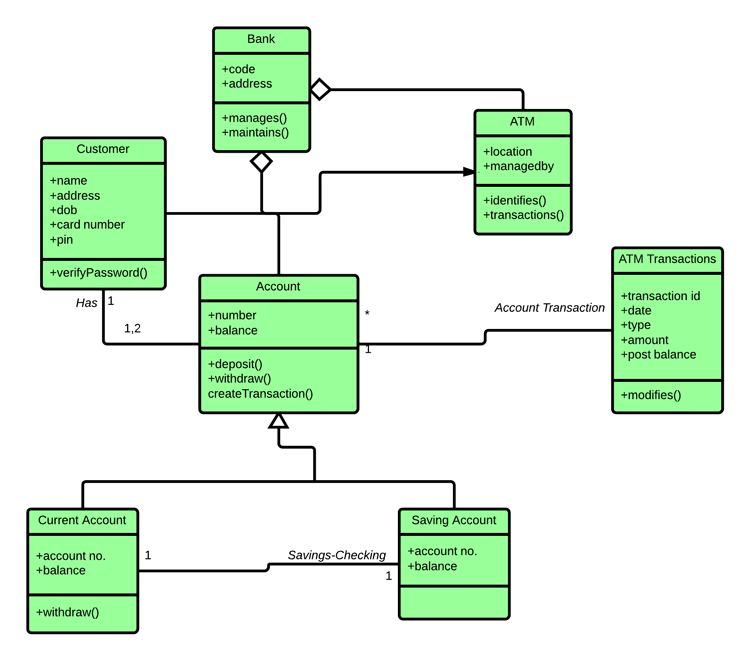

| Guide  | Tittle                                                                                |
| ------ | ------------------------------------------------------------------------------------- |
| **06-164** | **Overview of Class Diagram Elements**                                                    |
| 06-165 | UML Class Diagram Associations, Multiplicity, and Navigability (and Role)             |
| 06-166 | Deep Dive: Build Twitter Using Class Diagrams **(UML Customization for the Clarity)** |

---
# 06-164: Class Diagram Fundamentals 
---


## ***1. Overview***
---
Class diagrams are the most popular structural diagrams in UML. They provide a blueprint for your object-oriented system by showing the static structure of classes and their basic elements.


## ***2. Class Diagram Structure/Elements***
---
Every class diagram consists of **THREE main sections**:


---

### 1. ***Name Section***

### Purpose

- Identifies the class
- Should be a **noun** representing the entity
- Follows **PascalCase** convention

### Best Practices

- Use descriptive, meaningful names
- Avoid abbreviations unless universally understood
- Keep it concise but clear

### Examples

```
User
BankAccount
ShoppingCart
EmailService
```

---

### 2. ***Attributes Section***

Attributes represent the **data** or **properties** that objects of this class will hold.

### Required Components

Each attribute must include **three elements**:

1. **Visibility**
2. **Name**
3. **Data Type**

### Visibility Symbols

|Symbol|Visibility|Meaning|
|---|---|---|
|`+`|Public|Accessible from anywhere|
|`#`|Protected|Accessible within class and subclasses|
|`-`|Private|Accessible only within the class|

### Syntax Format

```
[visibility][name]: [dataType]
```

### Examples

```
+ firstName: String
+ lastName: String
+ age: Integer
- accountBalance: Double
# userId: Long
```

### Real-World Class Example


---

## 3. Operations Section

Operations represent the **behaviour*, the **methods** that the class can perform.

### Characteristics

- Always followed by **parentheses** `()`
- Use **visibility symbols** (same as attributes)
- Represent what the class **can do**

### Visibility Rules

- `+` (Public): Can be called from **outside** the class
- `-` (Private): Can **only** be called from **within** the class
- `#` (Protected): Can be called from class and **subclasses**

### Syntax Format

```
[visibility]   [methodName](): [returnType]
```

### Examples

```
+ deposit(): void
+ withdraw(): boolean
+ getBalance(): Double
- validateAccount(): boolean
# generateReport(): String
```


---


## 3. Programming Language Mapping***
---
### JavaScript/TypeScript Example

```typescript
class BankAccount {

    public accountNumber: string;
    public holderName: string;
    private balance: number;
    protected accountType: string;
    
    public deposit(): void { }
    public withdraw(): boolean { }
    public getBalance(): number { }
    private validateAccount(): boolean { }
    protected generateReport(): string { }
}
```

### Python Example

```python
class BankAccount:
    
    def __init__(self):
        self.account_number = ""    # public
        self.holder_name = ""       # public
        self.__balance = 0.0        # private
        self._account_type = ""     # protected
    
    
    def deposit(self):              # public
        pass
    
    def withdraw(self):             # public
        pass
    
    def get_balance(self):          # public
        pass
    
    
    def __validate_account(self):   # private
        pass
    
    def _generate_report(self):     # protected
        pass
```

---


## ***4. Common Data Types***
---
### Primitive Types

- `String` - Text data
- `Integer` - Whole numbers
- `Double/Float` - Decimal numbers
- `Boolean` - True/false values
- `Date` - Date/time values

### Object Types

- Custom class names (e.g., `User`, `Address`)
- Collections (e.g., `List<String>`, `Array<Integer>`)

---

## ***5. Quick Reference Template***
---
```
┌─────────────────────────┐
│         ClassName       │  ← PascalCase noun
├─────────────────────────┤
│ + attr1: Type           │  ← Public attribute
│ # attr2: Type           │  ← Protected attribute  
│ - attr3: Type           │  ← Private attribute
├─────────────────────────┤
│ + method1(): ReturnType │  ← Public method
│ # method2(): ReturnType │  ← Protected method
│ - method3(): ReturnType │  ← Private method
└─────────────────────────┘
```

---
