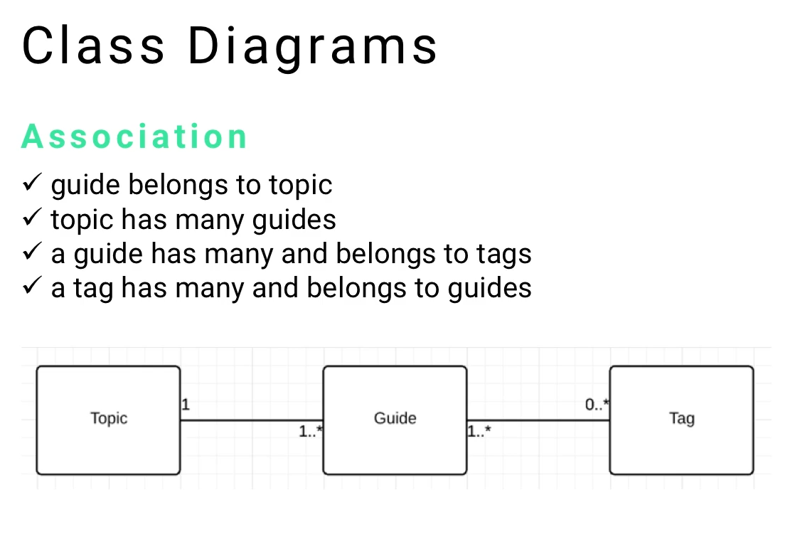
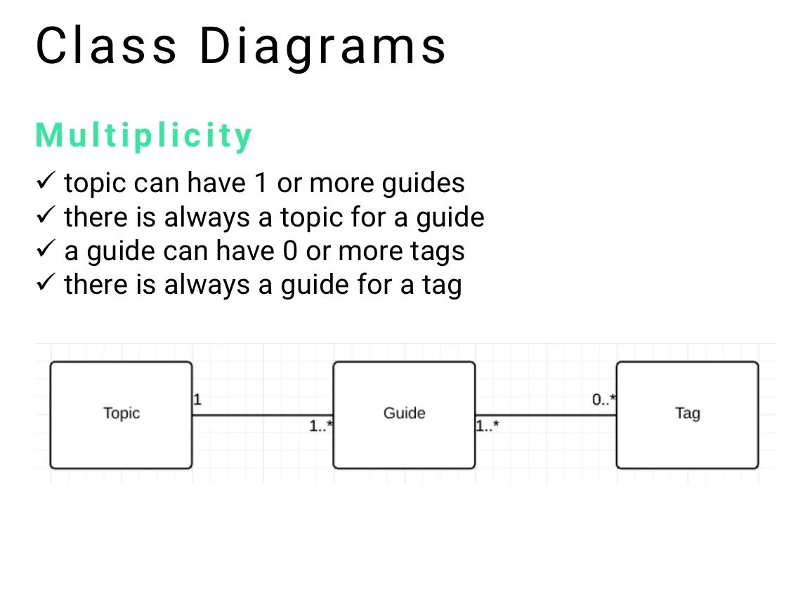
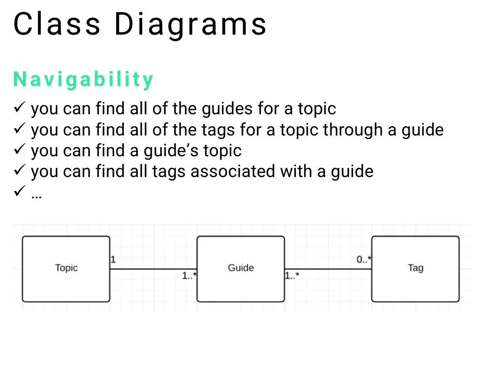

| Guide      | Tittle                                                                              |
| ---------- | ----------------------------------------------------------------------------------- |
| 06-164     | Overview of Class Diagram Elements                                                  |
| **06-165** | **UML Class Diagram Associations, Multiplicity, and Navigability (and Role)**       |
| 06-166     | Example: Build Twitter Using Class Diagrams **(UML Customization for the Clarity)** |

---
# 06-165: Class Diagram  Part 2
## Association [ Navigability - Multiplicity - Role]
---

1. Introduction to Class Relationships

2. Association Fundamentals
   2.1. Basic Relationship Concepts
   2.2. Topic-Guide-Tag Example
   2.3. Association Direction and Meaning

3. Multiplicity Specification
   3.1. Numerical Relationship Indicators
   3.2. Common Multiplicity Patterns
   3.3. Simplified Star Notation
   3.4. Real-World Application Examples

4. Navigability Rules
   4.1. Class Communication Pathways
   4.2. Traversal Capabilities
   4.3. UML Visual Advantage

5. Best Practices for Class Relationships

6. Implementation Guidelines

---

## ***1.    Introduction to Class Relationships***
---
While understanding individual class components (name, attributes, operations) forms the foundation of UML class diagrams, **establishing proper associations between classes completes the system design**.  

>Class **relationships define how objects interact, communicate, and depend on each other** within the system architecture.


The three (**four**) essential aspects of class relationships are:

- **Association**: The fundamental connection between classes
- **Multiplicity**: Numerical constraints defining relationship cardinality
- **Navigability**: Rules governing how classes can access and communicate with each other
- **Role**: Defined by stereotypes or comments which extends the Association context


These concepts work together to create precise, implementable system designs that translate directly into code structure and database relationships.

---


## ***2.   Association Fundamentals***
---
### Basic Relationship Concepts

Association represents the fundamental connection between classes, defining how instances of one class relate to instances of another.  
**In object-oriented systems, associations model real-world relationships and dependencies.**

#### **Association Principles**

- Associations are **bidirectional by default**
- Each association **has specific meaning and purpose**
- Association strength varies **from loose coupling to tight dependency**
- Proper associations enable **effective system navigation and data access**

---

### Topic-Guide-Tag Example

Using a content management system model with three classes:

#### **Relationship Definitions**

- **Guide belongs to Topic**: Each guide is categorised under one topic
- **Topic has many Guides**: Topics can contain multiple guides
- **Guide has many Tags**: Guides can be tagged with multiple keywords
- **Tag belongs to many Guides**: Tags can be applied to multiple guides



This creates a hierarchical content structure where topics organise guides, and tags provide cross-cutting categorization.

---
### Association Direction (Navigability) and Meaning

Association direction **determines relationship ownership and dependency**:

#### **Ownership Patterns**

- **One-to-Many**: Parent class contains multiple child instances
- **Many-to-Many**: Bidirectional relationships with multiple instances on both sides
- **One-to-One**: Singular relationship between class instances

The numerical indicators on association lines specify these relationships precisely, eliminating ambiguity in system design.

---

##  3.   Multiplicity Specification

### Numerical Relationship Indicators

Multiplicity **defines the quantitative aspects of associations** using specific notation:

#### **Standard Multiplicity Notation**

- `1`: Exactly one instance
- `0..1`: Zero or one instance (optional relationship)
- `1..*`: One or more instances (at least one required)
- `0..*` or `*`: Zero or more instances (completely optional)
- `n..m`: Specific range (where n and m are numbers)

### Common Multiplicity Patterns



#### **Topic to Guide Relationship: `1..*`**

- Each topic must have at least one guide
- Topics can contain unlimited guides
- Prevents orphaned topics without content

#### **Guide to Topic Relationship: `1`**

- Every guide belongs to exactly one topic
- Ensures clear content categorization
- Maintains hierarchical organization

#### **Guide to Tag Relationship: `0..*`**

- Guides can exist without tags
- Guides can have unlimited tags
- Flexible content classification system

#### **Tag to Guide Relationship: `1..*`**

- Tags must be associated with at least one guide
- Prevents unused tag accumulation
- Ensures tag relevance and utility

### Simplified Star Notation

For common many-to-many relationships, simplified notation using asterisk (`*`) symbols provides quick visual reference:

#### **Simplified Approach**

```
Guide <--------*-> Tag
```

This notation immediately **conveys that guides can have multiple tags**, making diagrams more readable for rapid comprehension.

---
### Real-World Application Examples

#### **Blogging System Implementation**

- **Topic**: "UML Modeling" contains multiple guides
- **Guide**: "Class Diagrams" belongs to UML topic, tagged with "design," "documentation," "OOP"
- **Tag**: "Design" appears across multiple guides in different topics


This structure enables flexible content organization while maintaining clear hierarchical relationships.


---


##  ***4.  Navigability Rules***
---
### Class Communication Pathways

Navigability defines **how objects can access and communicate with related objects through association paths**.  

#### **Navigation Capabilities**

- **Direct Access**: Following immediate association lines
- **Indirect Access**: Traversing multiple association paths
- **Bidirectional Navigation**: Access possible in both directions
- **Unidirectional Navigation**: Access restricted to specific directions


####  **Traversal Capabilities**

Using the Topic-Guide-Tag model, navigation possibilities include:



#### **From Topic:**

- Access all associated guides directly
- Access all tags indirectly through guides
- Aggregate tag information across all topic guides

#### **From Guide:**

- Access parent topic directly
- Access all associated tags directly
- Access sibling guides through parent topic

#### **From Tag:**

- Access all associated guides directly
- Access topics indirectly through guides
- Find related tags through shared guides

---
### UML Visual Advantage

UML's visual representation provides immediate understanding of navigation possibilities without extensive documentation:

#### **Benefits of Visual Navigation**

- **Immediate Comprehension**: Developers can **trace relationship paths visually**
- **Implementation Guidance**: Clear direction for code structure
- **Complexity Management**: Complex relationships become manageable through visual representation
- **Documentation Efficiency**: Single diagram replaces extensive written specifications


#### **Alternative Documentation Challenges:**   

Without UML, documenting navigation rules would require extensive written specifications:

- "Topics can access guides through the topic-guide association"
- "Guides can access tags through the guide-tag association"
- "Topics can access tags by traversing topic-guide-tag associations"

This text-based approach becomes unwieldy for complex systems with multiple classes and relationships.

---

## ***Best Practices for Class Relationships***
---

### Association Design Guidelines

- **Minimise Dependencies**: Reduce tight coupling between classes
- **Clear Ownership**: Establish obvious parent-child relationships
- **Consistent Direction**: Maintain logical relationship directions
- **Meaningful Names**: Use descriptive association labels when needed

---
### Multiplicity Best Practices

- **Realistic Constraints**: Reflect actual business rules and requirements
- **Optional vs. Required**: Carefully consider whether relationships are mandatory
- **Performance Implications**: Consider database and memory implications of multiplicity choices
- **Future Flexibility**: Design for potential requirement changes

---
### Navigability Considerations

- **Bidirectional Access**: Enable navigation in both directions when needed
- **Performance Optimization**: Consider query efficiency for frequently accessed paths
- **Security Implications**: Ensure navigation doesn't expose unauthorized data
- **Maintenance Simplicity**: Keep navigation rules as simple as possible

---
### Common Relationship Patterns

- **Composition**: Strong ownership (parent destroys children)
- **Aggregation**: Weak ownership (shared children)
- **Association**: Simple reference relationships
- **Dependency**: Temporary usage relationships

---


## ***Implementation Guidelines***
---

### Database Translation

Class associations translate directly to database relationships:

- **Foreign Keys**: Represent one-to-many associations
- **Junction Tables**: Handle many-to-many associations
- **Referential Integrity**: Enforce multiplicity constraints

---
### Code Implementation

Object-oriented code reflects association patterns:

- **Collection Properties**: Represent one-to-many relationships
- **Reference Properties**: Represent one-to-one relationships
- **Navigation Methods**: Implement traversal capabilities

---
### Validation and Constraints

Implement multiplicity rules through:

- **Database Constraints**: Enforce at data layer
- **Business Logic**: Validate in application layer
- **User Interface**: Guide user interactions appropriately

---
