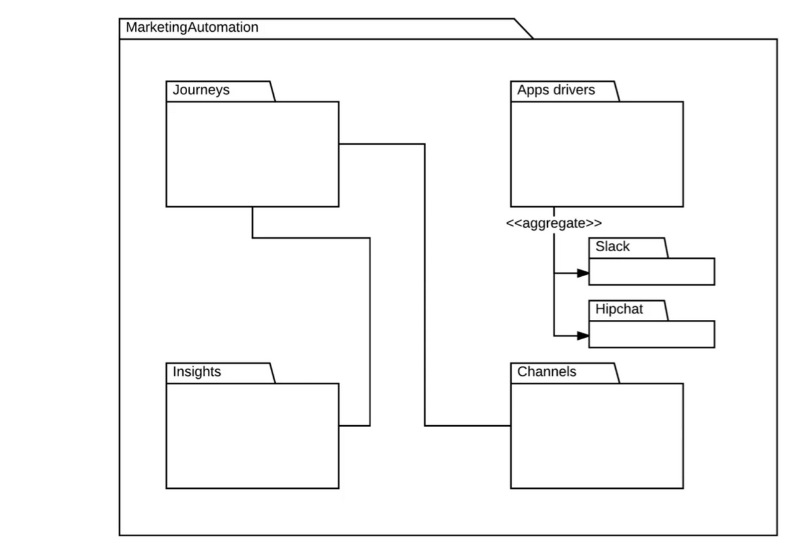

#### 3.5 Package

| Guide  | Tittle                                                         |
| ------ | -------------------------------------------------------------- |
| **07-178** | **Overview of UML Package Diagram Elements**                       |
| 07-179 | Deep Dive: Build a Marketing Automation System Package Diagram |

# 07-178:   Package Diagrams (1)

1. **Package Diagrams Introduction**

2. **Package Diagrams vs. Other UML Diagrams**
    1. High-Level vs. Low-Level Abstractions
    2. Comparison with Class Diagrams
    3. Distinction from Deployment Diagrams

3. **Core Elements of Package Diagrams**
    1. Abstract Elements
        1. Types
        2. Classifiers

    2. Concrete Elements
        1. Classes
        2. Use Cases
        3. Components
        4. Packages
        5. Dependencies
        6. Events

4. **Package Diagram Characteristics**
    1. Structural Representation
    2. Composition and Interconnection
    3. Dependency Visualisation

5. **Common Use Cases and Applications**
    1. Third-Party Libraries and Gems
    2. Module Organisation
    3. System Architecture Overview

6. **Design Philosophy and Goals**

7. **Best Practices**

---

## ***1.      What Package Diagrams are***
---
UML Package Diagrams represent one of the most ***abstract and high-level diagram types*** in the UML specification.  

Unlike other UML diagrams that focus on detailed implementation aspects, package diagrams serve as ***organisational tools*** that show how different components of a system are grouped and how they relate to each other at a structural level.

### 🎯 **The primary purpose of package diagrams is to:**

- Provide a ***high-level view*** of system organisation
- Show ***relationships and dependencies*** between major system components
- ***Group related elements*** into logical units
- ***Facilitate understanding*** of complex system architectures
- ***Support modular design*** and development approaches

---

## ***2.      Package Diagrams vs Other UML Diagrams***
---
### **2.1 High-Level   vs   Low-Level Abstractions**

Package diagrams operate at a ***fundamentally different abstraction level*** compared to most other UML diagrams.   

This distinction is crucial for understanding when and how to use them effectively.

#### 🔝 **High-Level Focus**

- System organisation and structure
- Component grouping and relationships
- Dependency management
- Architectural overview

#### ✨ **Abstraction Benefits**

- ***Simplified system understanding***
- Focus on major components rather than implementation details
- ***Clear visualisation*** of system boundaries
- ***Effective communication tool*** for stakeholders

---

### **2.2 Comparison with Class Diagrams**

The contrast between package diagrams and class diagrams illustrates the different abstraction levels:

#### 🔧 **Class Diagrams (Low-Level Detail)**

- Detailed attribute specifications
- Complete operation listings
- Precise connectivity definitions
- Multiplicity relationships
- ***Implementation-ready specifications***
- ***Direct code generation capability***

#### 🏗️ **Package Diagrams (High-Level Structure)**

- Component grouping and organisation
- Inter-package relationships
- Dependency visualisation
- Structural composition
- ***Architectural patterns***
- ***System-wide perspective***

> **💡 Key Insight:** Class diagrams speak directly to developers about code implementation, while package diagrams communicate ***architectural decisions*** to both technical and non-technical stakeholders.

---

### **2.3 Distinction from Deployment Diagrams**

While both package and deployment diagrams show system organisation, they serve ***different purposes***:

#### 🖥️ **Deployment Diagrams**

- ***Physical system deployment***
- Server and node configurations
- Hardware and infrastructure focus
- ***Runtime environment specifications***
- Network topology and connections
- Operational concerns

#### 📦 **Package Diagrams**

- ***Logical system organisation***
- Software structure and composition
- ***Development-time relationships***
- Module and component grouping
- Architectural patterns
- Design-time concerns

---

## ***3.      Core Elements of Package Diagrams***
---

Package diagrams can contain both ***abstract and concrete elements***, providing flexibility in how system components are represented and organised.

---
### **3.1 Abstract Elements**

#### **3.1.1 Types**

Abstract representations of data types or categories that ***don't correspond directly to implementation classes*** but represent conceptual groupings or classifications within the system.

#### **3.1.2 Classifiers**

General categorisation elements that ***group related components*** based on shared characteristics or behaviors. Classifiers provide a way to organize elements ***without specifying implementation details***.

---

### **3.2 Concrete Elements**

#### **3.2.1 Classes**

Actual class definitions from class diagrams can be included in package diagrams to show how ***specific classes are organized*** within the overall system structure.

#### **3.2.2 Use Cases**

Functional requirements and use cases can be grouped within packages to show how ***different functional areas relate*** to each other and to other system components.

#### **3.2.3 Components**

Larger system components that encapsulate multiple classes or functionality areas. Components represent ***deployable units*** or major system modules.

#### **3.2.4 Packages**

Nested packages allow for ***hierarchical organisation***, enabling complex systems to be broken down into manageable structural units with ***clear boundaries***.

#### **3.2.5 Dependencies**

Relationships between packages that show ***which components rely on others***. Dependencies are crucial for understanding ***system coupling*** and potential impact of changes.

#### **3.2.6 Events**

System events or triggers that ***cross package boundaries***, showing how different parts of the system communicate and respond to various conditions.

---

## ***4.      Package Diagram Characteristics***
---
### **4.1   Structural Representation**

Package diagrams excel at showing the ***structural organisation*** of software systems:

#### 🏗️ **Hierarchical Organisation**

- ***Top-level system decomposition***
- Nested package structures
- ***Clear boundary definitions***
- Logical grouping principles

#### 🧩 **Modular Design Support**

- ***Component separation and isolation***
- Interface definitions between modules
- ***Reusable component identification***
- System extensibility planning

---

### **4.2   Composition and Interconnection**

The composition aspect of package diagrams shows how ***smaller elements combine*** to form larger system components:

#### 🔗 **Element Composition**

- How classes group into packages
- How packages combine into larger modules
- ***Interface definitions*** between components
- ***Shared resource identification***

#### 🌐 **Interconnection Patterns**

- ***Communication pathways*** between packages
- Data flow between major components
- Control flow across package boundaries
- ***Integration points*** and interfaces

---

### **4.3   Dependency Visualisation**

One of the most ***powerful aspects*** of package diagrams is their ability to clearly show dependencies:

#### 📊 **Dependency Types**

- ***Usage dependencies*** (one package uses another)
- ***Import relationships*** (package imports elements from another)
- ***Access dependencies*** (package accesses another's public elements)
- ***Merge relationships*** (package contents are combined)

#### 🔍 **Dependency Analysis**

- ***Circular dependency identification***
- ***Coupling assessment***
- ***Impact analysis*** for changes
- ***Refactoring opportunity identification***

---

## ***5.      Common Use Cases and Applications***
---
### **5.1 Third-Party Libraries and Gems**

Package diagrams are particularly useful for ***designing and documenting libraries***:

#### 📚   **Library Structure**

- ***Core functionality packages***
- Utility and helper packages
- Extension and plugin packages
- ***Public API organisation***

#### ⚡   **Dependency Management**

- ***External library dependencies***
- Internal module dependencies
- ***Optional vs required dependencies***
- Version compatibility considerations

---

### **5.2 Module Organisation**

For large applications, package diagrams help ***organise modules***:

#### 📂   **Module Grouping**

- ***Feature-based organisation***
- ***Layer-based organisation*** (MVC, etc.)
- ***Domain-driven design packages***
- Cross-cutting concern packages

#### 🔄   **Integration Planning**

- ***Module interaction patterns***
- Shared resource management
- ***Interface standardisation***
- Testing strategy organisation

---

### **5.3   System Architecture Overview**

Package diagrams serve as ***excellent architectural communication tools***:

#### 👥 **Stakeholder Communication**

- ***High-level system overview*** for management
- ***Architecture decisions documentation***
- System evolution planning
- ***Technology stack organisation***

---

## ***6.      Design Philosophy and Goals***
---
The fundamental goal of package diagrams is to provide ***clarity and organisation*** to complex software systems:

#### 🎭 **Abstraction Management**

- ***Hide unnecessary implementation details***
- Focus on structural relationships
- Provide ***multiple levels of detail***
- Support ***iterative refinement***

#### 💬 **Communication Enhancement**

- ***Bridge technical and business perspectives***
- Facilitate architectural discussions
- Support ***design review processes***
- Enable ***effective documentation***

#### 🏆 **Design Quality**

- Promote ***modular design principles***
- Encourage ***loose coupling***
- Support ***high cohesion*** within packages
- Enable ***system scalability***

---

## ***7.      Best Practices and Guidelines***
---
###  🎯 **Package Design Principles**

- **Single Responsibility**: Each package should have ***one clear purpose***
- **Minimal Dependencies**: ***Reduce coupling*** between packages
- **Clear Interfaces**: Define ***explicit boundaries*** and interaction points
- **Hierarchical Organisation**: Use ***nested packages*** for complex systems

### 📝   **Documentation Standards**

- **Naming Conventions**: Use ***clear, descriptive*** package names
- **Dependency Documentation**: ***Explain why dependencies exist***
- **Interface Specifications**: Document ***package boundaries clearly***
- **Version Management**: Track ***package evolution*** over time

### 🚫   **Common Pitfalls to Avoid**

- **Over-Packaging**: Don't create packages for ***every small component***
- **Circular Dependencies**: Design to ***avoid circular relationships***
- **Unclear Boundaries**: Ensure package responsibilities are ***well-defined***
- **Implementation Leakage**: Keep ***implementation details out*** of package interfaces
