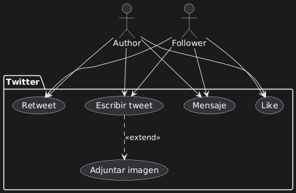
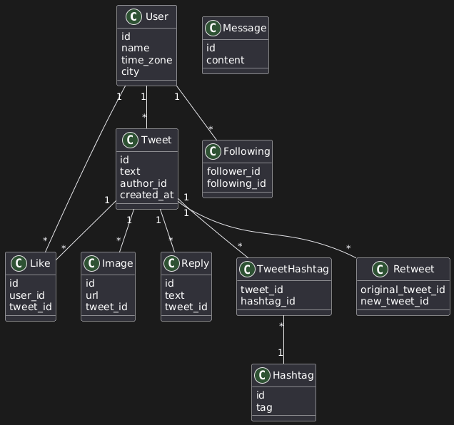
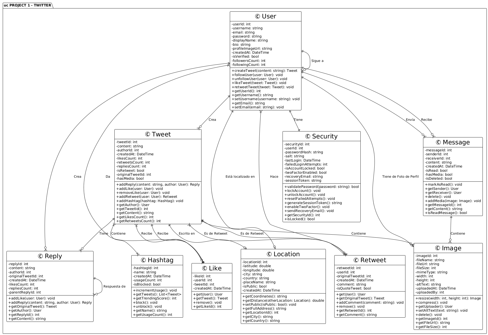

# Project 1: Design Twitter System

## Goals

Design the complete architecture of a Twitter-like social network system using UML diagrams. This project requires a **two-pronged approach** using both structural and behavioural diagrams.

---

## Requirements

### **Part 1: Use Case Diagram (Behavioural)**

**Purpose:** Visualise the types of authorisations that users have within the system.

**Actors:**

- User (general)
- Follower (specific role)

**Required Use Cases:**

- Posting tweets
- Retweets and Likes
- Optional features (e.g., images to posts)

**Key Objectives:**

- Show what actions each actor can perform
- Demonstrate authorisation levels
- Use `<<include>>` and `<<extend>>` relationships appropriately

---

### **Part 2: Class Diagram (Structural)**

**Purpose:** Create a blueprint for the database structure with all associations and multiplicities.

**Required Classes:**

1. User
2. Tweet
3. Retweet
4. Preference
5. Security
6. Message
7. Hashtag
8. Reply
9. Like
10. Location
11. Image
12. Following (for users to follow other users)

**Key Objectives:**

- List attributes for each class
- Define operations (method names) - optional but recommended
- Set up relationships between classes (associations)
- **Critical:** Implement multiplicity correctly (hasMany/belongsTo)
- Show navigability between classes
- Create join tables where appropriate

**Important Note:** Each class represents a database table. Think about how Twitter actually works and model accordingly.

---

## A) Use Case Diagram



### **Actors Defined**

**1. Author**

- Represents someone who authors (creates) tweets
- Has full access to posting functionality

**2. Follower**

- Represents someone who follows other users
- Technically interchangeable with Author in Twitter's model
- Separated to show different perspectives of system use

**Key Insight:** In Twitter, every user is both an author and a follower. The separation in the use case diagram helps visualise different interaction patterns.

---

### **Use Cases and Relationships**

**Primary Use Case: "Write a tweet"**

This central use case **includes** several sub-functionalities:

- Retweet a tweet (`<<include>>`)
- Like a tweet (`<<include>>`)
- Send a message (forward tweet) (`<<include>>`)

**Extended Functionality:**

- Attach image to post (`<<extend>>`)

**Distinction:**

- `<<include>>`: Mandatory functionality that's part of the base use case
- `<<extend>>`: Optional functionality that extends the base use case

---

### **Actor Capabilities**

**Author can:**

- Write a tweet (primary action)
  - Which includes: retweet, like, message
  - Which can extend to: attach image
- Full system access

**Follower can:**

- Write a tweet
- Retweet
- Like
- Message

**Why both actors have same access:** In Twitter's design, there's no fundamental difference between an "author" and a "follower"—every user has the same capabilities. The diagram shows this reality.

---

**Balance in Design:**

- Avoid over-complexity (too many actors, extensions, includes)
- Avoid over-simplification (missing key connections)
- Goal: Core functionality visible in minutes

**Practical Application:** If handed to a developer, this diagram should allow them to:

- Understand authorisation framework
- Begin building feature set
- See relationships between actions

---

## B) Class Diagram



**Tweet Class (Central Entity)**

Attributes:

- `id`
- `text`
- `author_id` (reference to User)
- `retweeted` (boolean)
- `created_at` (timestamp)
- `like_count`
- `hashtag`

Operations:

- `new()`
- `create()`
- `edit()` (optional)

**Design Philosophy:** The instructor intentionally omits data types (text, varchar, int) unless they're custom types requiring explanation. This saves time and reduces clutter.

---

### **Critical Concept: Multiplicity**

**Example: Tweet → Like**

```
Tweet (1) ────→ (*) Like
```

**What this means:**

- One tweet can have many likes
- Each like belongs to one tweet
- **Database implication:** The `likes` table must have a `tweet_id` foreign key

**Why multiplicity is critical:** If multiplicity is incorrect, developers will build the wrong database structure and have to refactor later.

---

### **Join Tables (Many-to-Many Relationships)**

**Visual Convention:** Represented with dotted lines to distinguish from regular classes.

**Example: TweetHashtag**

```
Tweet (1) ····→ (*) TweetHashtag (*) ←···· (1) Hashtag
```

**Why dotted lines?**

- Visual distinction: Easy to identify join tables at a glance
- Functional distinction: Join tables have no operations, only IDs
- Dependency ordering: You cannot create `TweetHashtag` until both `Tweet` and `Hashtag` tables exist

**Navigability:** Join tables enable bidirectional queries:

- From Tweet: "Show me all hashtags for this tweet"
- From Hashtag: "Show me all tweets with this hashtag"

---

### **Self-Referential Tables**

**1. Retweet (Self-Referential Join Table)**

```
Retweet
─────────────
original_tweet_id
new_tweet_id
content (optional: for quote tweets)
```

**Concept:** A retweet IS a tweet. No separate class needed—just a reference to itself.

**Real-world example:** When you retweet a friend's post:

1. System creates new tweet record (your retweet)
2. `Retweet` table stores: `original_tweet_id` (friend's tweet) + `new_tweet_id` (your tweet)

---

**2. Following (Self-Referential for Users)**

```
Following
─────────────
follower_id (User A)
following_id (User B)
```

**Relationships:**

```
User (1) ────→ (*) Following (*) ←──── (1) User
```

**This enables:**

- "Show all users that John follows" (query `following_id` where `follower_id = John`)
- "Show all of Mary's followers" (query `follower_id` where `following_id = Mary`)
- **Generate feed:** Retrieve tweets from all users in John's `following_id` list

**Applications beyond social networks:**

- Notification systems
- Organisational hierarchies
- Any system requiring self-referential relationships

**Why it's critical:** Nearly every large-scale application needs this pattern somewhere. Understanding it thoroughly is essential.

---



---

### **Design Principles Explained**

**1. Why omit method names?**

Standard CRUD operations (`new()`, `create()`, `edit()`, `update()`) are understood by all developers. Including them is boilerplate that wastes time.

**Exception:** Include custom/special methods that differ from standard patterns.

**2. Why omit data types?**

Data types are often obvious from context:

- `text` → varchar or text type
- `id` → integer
- `created_at` → timestamp

**Exception:** Include custom types that need explanation.

**3. Focus on multiplicities**

This is where errors cause the most problems. A developer can infer data types but **cannot infer relationship structures**.

---

### **Real-World Development Workflow**

**How developers use this diagram:**

1. **Copy attributes** → Paste into model generators
2. **Read multiplicities** → Define foreign keys and associations
3. **Identify join tables** → Create these AFTER primary classes
4. **Implement self-referential** → Add special query logic

**Goal:** Break the system into smallest possible chunks. Each class diagram element translates directly to code.

---

### **Use Case Diagram Skills**

✅ Define actors (human and non-human)
✅ Identify core use cases
✅ Apply `<<include>>` and `<<extend>>` correctly
✅ Balance complexity vs. simplicity
✅ Create diagrams readable by non-technical stakeholders

### **Class Diagram Skills**

✅ Structure database relationships
✅ Implement multiplicity correctly
✅ Design join tables for many-to-many relationships
✅ Create self-referential tables
✅ Distinguish between what's essential and what's boilerplate
✅ Translate diagrams directly to code

---

## 💡 Key Insights

**"10 developers = 10 variations"**

There is no single "correct" solution. What matters:

- ✅ Core functionality is present
- ✅ Multiplicities are correct
- ✅ Relationships make sense
- ✅ System is scalable

**Mandatory elements:**

- Correct multiplicities
- Clear hasMany/belongsTo relationships
- Join tables for many-to-many

**Optional/flexible:**

- Exact attribute names
- Operation names
- Data type specifications
- Visual styling (as long as it's clear)

---

**This approach applies to:**

- Any social network design
- Systems with user interactions
- Platforms with content creation and engagement
- Applications requiring complex many-to-many relationships

**The fundamental skill:** Breaking down a complex system into manageable, well-structured pieces BEFORE writing code.

This prevents the common junior developer pitfall: building halfway through a project, then realising the architecture needs complete restructuring.

---
