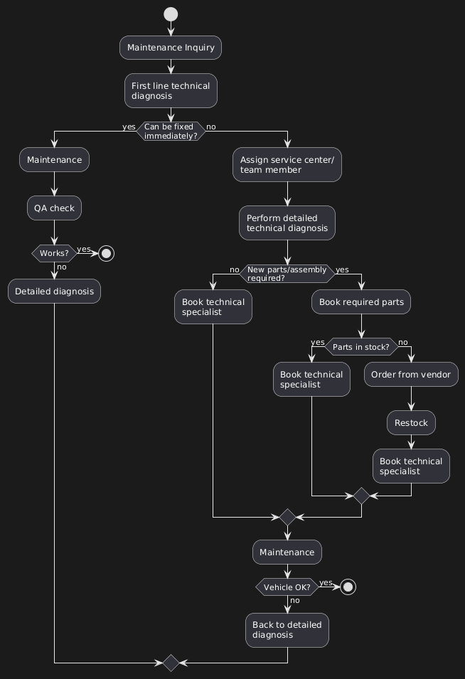
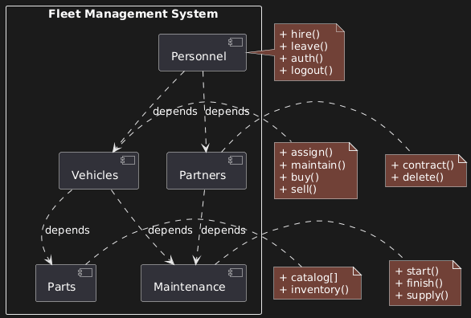
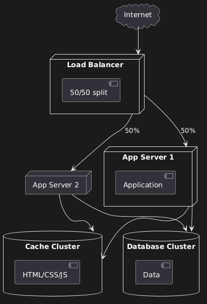

# Project 4: Enterprise Fleet Management System

## GOAL

Design a comprehensive fleet management system for tracking vehicles, maintenance, parts, and personnel. This project simulates real-world scenarios where requirements are vague and you must develop your own mental model for system design.

Unlike previous projects with clear specifications, this mirrors actual client interactions: "We want to track vehicles, service records, maintenance logs, parts orders..." Your job is to transform vague requirements into a complete, well-architected system.

The project requires **four diagrams**, progressing from high-level behaviour through to detailed implementation.

---

## REQUIREMENTS

### A. Activity Diagram (Behavioural)

**Purpose:** Model the complete maintenance process, which has numerous activities requiring visualisation.

**Process Focus:** Maintenance workflow (8-12 activities)

**Start Point:** Maintenance Inquiry **End Point:** Maintenance Complete

**Example Activities:**

- Technical diagnosis
- Assign service member
- Order parts
- Check parts availability
- Book technical specialist

**Critical Requirements:**

- Include decision points
- Add guards (conditions)
- Show dynamic behaviour
- Model what happens when things don't go right

**Context:** The fleet manager hasn't provided a detailed requirements list—just "track vehicles, service records, maintenance logs, parts orders." You must extrapolate the complete workflow.

---

### B. Package Diagram (Structural)

**Purpose:** Model high-level modules and their dependencies before defining any classes.

**Required Modules:**

1. Personnel
2. Vehicles
3. Parts
4. Maintenance
5. Partners

**Must Include:**

- Operations for each module
- Dependencies between modules
- Clear indication of access points

**Design Consideration:** Some modules (like Parts) will translate directly to database classes. Others (like Maintenance) will be mini-applications with their own workflows, classes, and helper methods.

---

### C. Deployment Diagram (Infrastructure)

**Purpose:** Design the overall system architecture for an enterprise application.

**Required Nodes:**

- Load balancer
- Application servers
- Database clusters
- Caching

**Research Required:** You'll need to investigate what these components do. When designing systems, you're constantly designing things you've never built before. Research is a huge component of the planning stage.

**Key Questions to Answer:**

- What does a load balancer do?
- How do application servers work together?
- Why separate caching from database?
- What's the purpose of database clusters?

---

### D. Class Diagram (Detailed Structure)

**Purpose:** Design the complete database structure with proper normalisation for enterprise efficiency.

**Required Classes:**

1. Vehicle
2. CarModel
3. CarBrand
4. ProductionFacility
5. Dealer
6. Technician
7. Role
8. Maintenance
9. MaintenanceType
10. ServiceCenter
11. Service
12. ServiceList
13. MaintenancePart
14. Part
15. Vendor
16. Assembly

**Key Focus:** Breaking tables into smaller, more efficient pieces. In enterprise applications, database efficiency is critical. Avoid classes containing information they don't need.

**Design Choice:** Decide whether to use inheritance or simply specify that some models are more generic whilst others are more specialised.

---

## A. ACTIVITY DIAGRAM



### Overview

This diagram tracks the complete maintenance process, from initial inquiry through to completion. The focus is on visualising branching logic—what happens when expectations aren't met.

### The Fundamental Principle

**Most Important:** Activity diagrams aren't about the "happy path" where everything works perfectly. The complexity comes from modelling what happens when one or multiple things don't go right.

If everything works perfectly, the diagram would be trivial:

```
Maintenance inquiry → Technical diagnosis → Maintenance → Done
```

But reality is messy. That's what we're modelling.

### Flow Breakdown

**1. Starting Point: Maintenance Inquiry**

A truck driver reports: "Something might be wrong with my truck" or it's simply time for regular maintenance (oil change, new brakes, etc.).

**2. First Line Technical Diagnosis**

Initial review process. An admin or system user sees all the data and performs a high-level check.

This isn't detailed—it's a triage:

- Can we fix this immediately?
- Do we need parts?
- Is this a major issue or minor?

**3. First Decision: Can it be fixed immediately?**

```
Can fix immediately?
  ├─ YES → Maintenance → QA Check → Done
  └─ NO → Continue to detailed process
```

**The Easy Path:** If it's a quick fix (loose bolt, simple adjustment), send directly to maintenance, verify everything works, and complete.

**Reality:** This rarely happens. Most issues require the detailed process.

**4. Assign Service Center/Team Member**

Common activity in many systems:

- Workflow management systems
- Expense approval processes
- Document review systems
- Any multi-stage process with role assignment

**5. Detailed Technical Diagnosis**

Different from "first line diagnosis." This is thorough:

- Full inspection
- Diagnostic tools
- Detailed notes
- Assessment of all potential issues

The level of detail you build into the diagram should match the level of functionality needed in the codebase.

**6. Critical Decision: New Parts or Assembly Required?**

```
Parts/Assembly needed?
  ├─ NO → Book technical specialist
  └─ YES → Book required parts
            ↓
       Parts in stock?
       ├─ YES → Book technical specialist
       └─ NO → Order from vendor
                ↓
           Restock → Book technical specialist
```

This is where the activity diagram connects to the package diagram. The system must check inventory (Parts module) and potentially interact with external vendors (Partners module).

**7. Book Technical Specialist**

All paths converge here. Whether parts were needed or not, we now need a specialist to perform the work.

**8. Perform Maintenance**

The actual repair/service work.

**9. Final Validation: Vehicle OK?**

```
Vehicle OK?
  ├─ YES → END
  └─ NO → Loop back to Detailed Technical Diagnosis
```

**Critical Loop:** If the maintenance didn't solve the problem, we don't just give up. Loop back and start the detailed diagnosis again.

This loop represents:

- Misdiagnosis
- Additional problems discovered
- Parts that didn't solve the issue
- Need for different approach

### Why This Structure Matters

**Real-World Patterns:**

This exact pattern appears in:

- **Expense Systems:** Employee submits → Approval check → Approved/Denied/More info needed
- **Document Review:** Submit → Initial review → Detailed review → Accepted/Revisions needed
- **Support Tickets:** Create → Triage → Assign → Resolve → Verify/Reopen

The maintenance workflow is a template for countless business processes.

**Building from Diagrams:**

A developer receiving this diagram would know to build:

- Forms for maintenance inquiry
- Role-based access (who can perform diagnosis vs maintenance)
- Parts inventory system
- Vendor ordering system
- Specialist scheduling system
- QA verification system
- Loop-back logic for failures

All from one visual diagram.

---

## B. PACKAGE DIAGRAM



### Overview

Five modules comprise the fleet management system. The most important element: showing dependencies.

### The Five Modules

**1. Personnel**

Tracks drivers, admins, technicians, etc.

Operations:

- `hire()`
- `leave()`
- `auth()` (authentication)
- `logout()`

May include users who never log into the system (truck drivers who don't need system access).

**2. Vehicles**

The fleet itself.

Operations:

- `assign()` (assign vehicle to driver)
- `maintain()` (schedule maintenance)
- `buy()` (acquire new vehicles)
- `sell()` (dispose of vehicles)

The buy/sell operations were critical in the original system—knowing purchase price dictated maintenance budget decisions.

**3. Parts**

Catalogue of available parts.

Operations:

- `catalog[]` (list all parts)
- `inventory()` (check stock levels)

This is relatively straightforward—directly translates to a database table with methods.

**4. Maintenance**

The entire maintenance workflow.

Operations:

- `start()` (begin maintenance process)
- `finish()` (complete maintenance)
- `supply()` (manage supply chain)

This is NOT just a database table. It's a mini-application:

- Multiple classes
- Helper methods
- Workflow logic (as seen in activity diagram)
- Complex business rules

**5. Partners**

External vendors and suppliers.

Operations:

- `contract()` (add new vendor)
- `delete()` (remove vendor)

Provides information to Personnel (who can add/delete contracts) and to Maintenance (parts availability, ordering).

### The Dependency Map

```
Personnel ──→ Partners
Personnel ──→ Vehicles

Vehicles ──→ Parts
Vehicles ──→ Maintenance

Partners ──→ Maintenance
```

**Why These Dependencies?**

**Personnel → Partners:** Only users (in Personnel) can add or delete vendor contracts. Partners provides data, but Personnel controls access.

**Personnel → Vehicles:** Users interact with vehicles. Could be designed differently (authentication as separate app), but in this system, it's a direct dependency.

**Vehicles → Parts:** Vehicles need the parts catalogue. "Needs access to" = dependency. When maintaining a vehicle, you must know what parts are available.

**Vehicles → Maintenance:** Maintenance processes are tied to specific vehicles.

**Partners → Maintenance:** Partners provide parts availability data. This connects to the activity diagram: when checking if parts are in stock, the system queries Partners.

### Critical Insights

**Dependency ≠ Just "Don't Delete":**

Dependencies also represent **access levels**. Personnel can access Vehicles, but Vehicles doesn't access Personnel directly. It's a one-way relationship.

**Could Be Different:**

If Personnel were a standalone authentication app serving multiple systems (fleet management + asset management + others), it wouldn't depend on Vehicles. It would be completely independent.

In this design, Personnel is tightly coupled to the fleet management system, so dependencies exist.

**Parts vs Maintenance:**

Both look similar in the diagram, but they're fundamentally different:

- **Parts:** Simple database class. CRUD operations. Straightforward.
- **Maintenance:** Complex subsystem. Multiple classes. Workflow engine. Business logic. Almost its own application.

This is why package diagrams are **abstract**—they don't reveal implementation details. That comes in class diagrams.

### The Evolution Reality

**This is a First Draft:**

The instructor explicitly states: the actual built system is much larger and different. This diagram was the initial planning, not the final architecture.

**No One Gets It Perfect First Time:**

Package diagrams are for brainstorming and organisation. You'll discover missing components as you build. You'll realise some modules need splitting. Some need combining.

The point isn't perfection—it's getting a **head start**. Structure your thinking before code locks you into an architecture.

---

## C. DEPLOYMENT DIAGRAM



### Overview

This diagram models the physical infrastructure for an enterprise fleet management system, including redundancy, caching, and load balancing.

### The Architecture

```
              Internet
                 ↓
          Load Balancer
           (50/50 split)
          ↙            ↘
    App Server 1    App Server 2
          ↓                ↓
          └────────┬───────┘
                   ↓
          ┌────────┴────────┐
          ↓                 ↓
    Cache Cluster    Database Cluster
```

### Load Balancer: Traffic Distribution

**Concept:** 50/50 split means alternating requests between servers.

**Flow:**

- User A visits site → Load balancer sends to Server 1
- User B visits site → Load balancer sends to Server 2
- User C visits site → Load balancer sends to Server 1
- And so on...

**Benefits:**

**1. Balance the Load:** Don't overburden one server whilst another sits idle. Distribute traffic evenly.

**2. Redundancy:** If App Server 1 crashes, Server 2 handles all requests. System stays online.

**Configuration:** Load balancers perform health checks:

- Ping servers regularly
- If a server doesn't respond, route traffic elsewhere
- When server comes back online, add it back to rotation

This is basic implementation. More sophisticated setups use:

- Weighted distribution (70/30 if one server is more powerful)
- Geographic routing (send EU users to EU servers)
- Load-based routing (send to least busy server)

### Cache Cluster: Performance Optimisation

**What Gets Cached:**

- CSS stylesheets
- JavaScript files
- HTML templates
- Images
- Static assets

**What Doesn't Change Regularly:**

These files might update weekly, daily, or even less frequently. Loading them from cache is dramatically faster than regenerating them for every request.

**The Process:**

1. User requests page
2. System checks cache: "Do I have this CSS file?"
3. If yes: Serve from cache (milliseconds)
4. If no: Generate/fetch file, store in cache, serve to user

**Cache Expiration:**

When you deploy updates:

- Push new CSS to server
- Force cache expiration
- Next request fetches new version
- New version gets cached

**Third-Party Services:**

Common providers:

- Cloudflare
- Amazon AWS CloudFront
- Fastly

These services cache your assets geographically close to users. A user in Australia gets assets from an Australian cache server, not from your UK-based origin server.

### Database Cluster: Data Management

**Why Separate from Cache?**

**The Key Difference:** Cache is for data that doesn't change often. Database is for data that changes constantly.

**Example: Maintenance Status**

User wants to check maintenance request status:

- If cached: Shows old status, even if technician just updated it
- If from database: Shows current status, updated in real-time

**What Goes in Database:**

- User accounts
- Maintenance records
- Parts inventory (changes as parts are used)
- Vehicle information
- Service histories

**Data Caching Considerations:**

You CAN cache some database queries:

- "List of all vehicle makes" (changes rarely)
- "Company locations" (static data)
- "Service types offered" (mostly stable)

But be selective. Always ask: "How often does this change? How important is real-time accuracy?"

**Database Clustering:**

Multiple database servers working together:

- Master handles writes
- Replicas handle reads
- Automatic failover if master goes down
- Geographic distribution for global systems

### How It All Works Together

**Request Flow:**

1. User visits site
2. Load balancer routes to App Server 1
3. App Server 1 needs CSS: checks Cache Cluster → gets cached file
4. App Server 1 needs maintenance data: queries Database Cluster → gets current data
5. Response combines cached assets (fast) + live data (current)
6. User sees up-to-date page, loaded quickly

**Why This Architecture?**

**Scalability:** Add more app servers as traffic grows **Reliability:** Multiple points of redundancy **Performance:** Caching reduces database load **Maintainability:** Can update one server whilst others stay online

---

## D. CLASS DIAGRAM


### Overview

This is a CRUD-based application (Create, Read, Update, Delete). The focus is on breaking tables into appropriate pieces for enterprise efficiency.

### The Normalisation Example: Parts

**The Question:** Why separate `Part` and `MaintenancePart`?

**Could Be Combined:**

Technically, `MaintenancePart` is a type of `Part`. You could use inheritance:

```
Part
  └─ MaintenancePart (inherits from Part)
```

Or you could just have one `Part` table.

**The Scalability Argument:**

Fleet management does well. Expands services. Now the company wants to track:

- Maintenance parts (current)
- **Inventory parts** (parts for sale to customers)
- **Wholesale parts** (B2B client orders)

If you only have `MaintenancePart`:

1. Create `InventoryPart` class
2. Create `WholesalePart` class
3. Refactor all existing code that assumed only maintenance parts existed

**The Better Design:**

```
Part (generic/shared)
  ├─ MaintenancePart (specific)
  ├─ InventoryPart (future)
  └─ WholesalePart (future)
```

Separation now prevents massive refactoring later. This is **planning for success**.

**Could Connect Directly:**

Could you connect `Part` directly to `ServiceList`? Yes, technically. But when you need to add inventory parts, you're stuck. Future-proofing requires separation.

### One-to-One Relationships

**The Vehicle → CarModel Relationship:**

```
Vehicle (1) ←→ (1) CarModel
```

**Benefits:**

**Direct Navigability:**

```ruby
vehicle.car_model
```

Simple, clean, efficient. One vehicle has exactly one model.

**Common Misconception:**

Many developers assume every relationship must be:

- One-to-many (1:*)
- Many-to-many (*:*)

**Reality:** One-to-one relationships are common and powerful. They clean up your codebase by simplifying object communication.

**When to Use One-to-One:**

- Vehicle has one Model
- User has one Profile
- Order has one ShippingAddress (at time of order)
- Invoice has one PaymentMethod

Not everything needs multiplicity. Sometimes the relationship is simple and direct.

### The Complete Picture

**Main Entities:**

**Vehicles:**

- Vehicle, CarModel, CarBrand
- ProductionFacility, Dealer

**Personnel:**

- Technician, Role

**Maintenance:**

- Maintenance, MaintenanceType
- ServiceCenter, Service, ServiceList

**Parts:**

- MaintenancePart, Part
- Vendor, Assembly

**Relationships to Consider:**

- Technician hasMany Maintenance jobs
- Maintenance belongsTo MaintenanceType
- ServiceCenter hasMany Maintenance records
- Vendor supplies many Parts
- Parts used in many ServiceLists (many-to-many)

The diagram doesn't have surprising complexity—it's a well-structured CRUD application. The lesson is in the **proper separation** of concerns and **planning for scale**.

---

## KEY TAKEAWAYS

### Activity Diagram

**Model Failures:** Happy path is easy. Complexity is in error handling, loops, alternative flows.

**Branching Logic:** Each decision point requires validation code. Map out ALL possible paths.

**Universal Patterns:** This maintenance workflow template applies to countless business processes.

### Package Diagram

**Dependencies First:** The most critical aspect is showing what depends on what. This prevents breaking changes.

**First Draft is OK:** No one gets architecture perfect initially. Package diagrams are for brainstorming and organisation.

**Abstract ≠ Vague:** High-level doesn't mean unclear. It means focusing on structure over implementation.

### Deployment Diagram

**Redundancy Matters:** Load balancers and multiple servers prevent single points of failure.

**Cache Wisely:** Static assets: cache aggressively. Dynamic data: cache carefully or not at all.

**Separation of Concerns:** Cache cluster for performance. Database cluster for accuracy. Each has a specific role.

### Class Diagram

**Break Tables Apart:** Enterprise efficiency requires proper normalisation. More tables isn't bad—it's scalable.

**One-to-One is Valid:** Not everything is one-to-many. Simple relationships are powerful.

**Plan for Growth:** Separate now to avoid refactoring later. Assume your system will succeed and expand.

### The Project Workflow

**Order Matters:**

1. Activity Diagram → Understand behaviour
2. Package Diagram → Organise modules
3. Deployment Diagram → Design infrastructure
4. Class Diagram → Implement database

Each diagram informs the next. Behaviour → Structure → Infrastructure → Implementation.

### Real-World Application

This isn't just about fleet management. These patterns apply to:

- Asset management
- Equipment tracking
- Service businesses
- Maintenance companies
- Any system with inventory, personnel, and workflows

The fundamental skills are **transferable** across domains and technologies.
