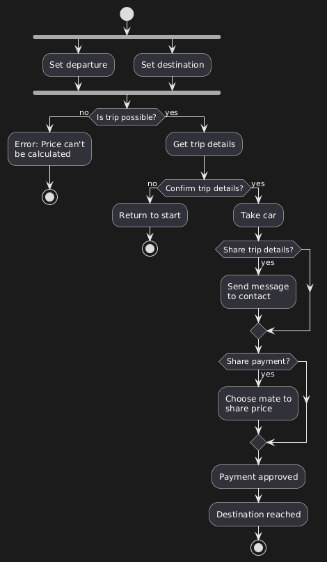
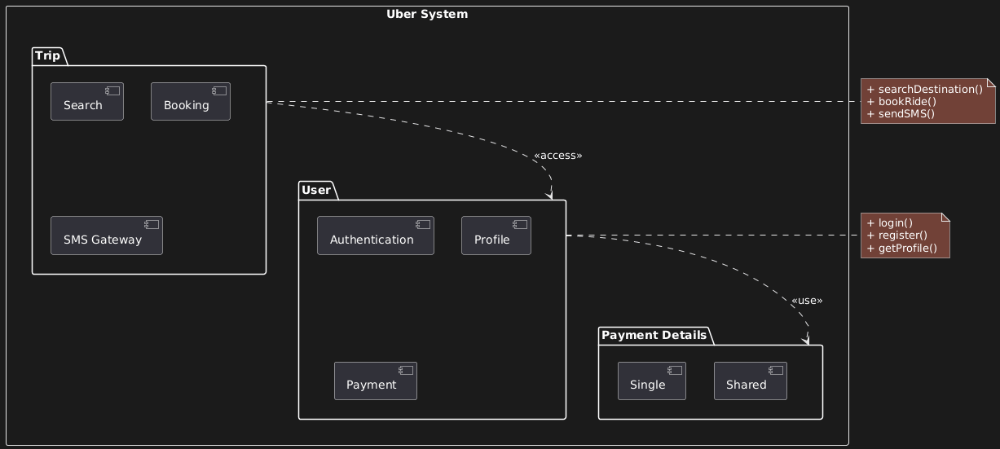
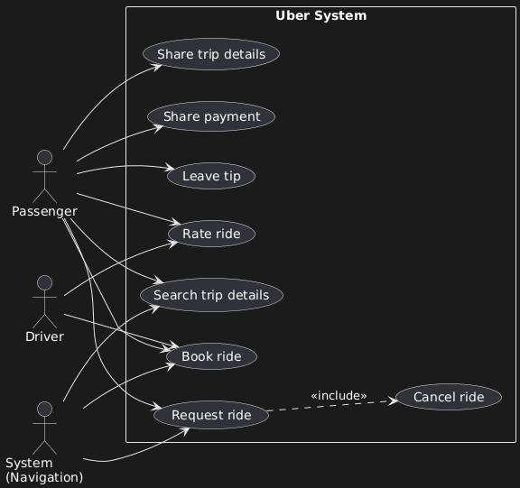
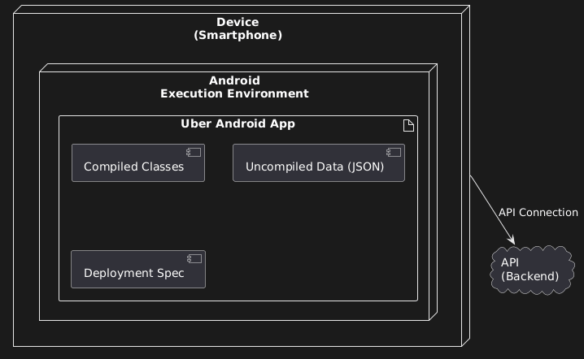

# Project 5: Uber Ride Sharing System

## GOAL

Design a complete ride-sharing system covering passengers, drivers, and navigation. This project uses four different diagrams to model behaviour, module organisation, authorisations, and mobile architecture.

---

## REQUIREMENTS

### A. Activity Diagram (Behavioural)

**Process:** Complete journey from ordering a car to reaching destination.

**Key Activities:**

- Set departure/destination
- Validate trip possibility
- Confirm trip details
- Take car
- Share trip details (optional)
- Share payment (optional)
- Payment processing

**Focus:** Multiple decision points that change user experience.

---

### B. Package Diagram (Structural)

**Main Modules:**

- User (Authentication, Profile, Payment)
- Trip (Search, Booking, SMS Gateway)

**Key Requirement:** Show proper nesting of modules (e.g., Payment contains Single and Shared payment types).

---

### C. Use Case Diagram (Behavioural)

**Actors:**

- Passenger
- Driver
- System (navigation engine)

**Features:** Search, Request, Book, Cancel, Rate, Share, Tip

**Focus:** Show different access levels between actors and demonstrate `<<include>>` relationships.

---

### D. Deployment Diagram (Infrastructure)

**Focus:** Android mobile app architecture + API connection.

**Components:**

- Device (smartphone)
- Execution environment (Android/Java)
- API backend
- Compiled vs Uncompiled data

**Key Point:** Mobile apps cannot function without API. Show this critical dependency.

---

## A. ACTIVITY DIAGRAM



### Flow Structure

**Start:** Car ordered

**Initial Branch (without "?"):** This is NOT a decision—it's multiple inputs converging.

- Set departure (geolocation)
- Set destination (typed address)

Both inputs merge into the next step.

**First Validation:**

```
Is trip possible?
  ├─ NO → Error: Price can't be calculated → END
  └─ YES → Get trip details (price, drivers, ETA)
```

Example failure: NYC to Australia = impossible.

**User Confirmation:**

```
Confirm trip details?
  ├─ NO → Return to start
  └─ YES → Take car
```

**Optional Features:**

```
Share trip details?
  ├─ YES → Send message to contact
  └─ NO → Continue

Share payment?
  ├─ YES → Choose mate to share price
  └─ NO → Continue
```

**End:** Payment approved → Destination reached

### Key Concepts

**Branch without "?":** Represents multiple inputs, not a decision. UML mechanism for showing several flows converging into one activity.

**Validation Points:** Each "?" represents a potential failure or user choice that changes the flow.

**Optional vs Required:** Trip validation is required. Sharing features are optional but enhance UX.

---

## B. PACKAGE DIAGRAM



### Module Structure

**User Module**

- Authentication (login/security)
- Profile (user data, ratings, history)
- Payment
  - Single payment
  - Shared payment

**Trip Module**

- SMS Gateway (imported library)
- Search (destinations, addresses)
- Booking (ride management)

### Dependencies

```
User ──<<use>>──→ Authentication
User ──<<use>>──→ Payment
Trip ──<<access>>──→ User
```

**Critical Distinction:**

**`<<use>>`:** Deep dependency. User NEEDS Authentication to function. Strong coupling.

**`<<access>>`:** Light dependency. Trip only needs to read User data (who's logged in). Weak coupling.

**`<<import>>`:** Third-party library (SMS Gateway). Not built by you, just imported.

### Nesting Rules

Payment module contains Single and Shared. These are NOT directly accessible from User—only through Payment interface.

**Why?** Encapsulation. User interacts with Payment abstraction, not specific implementations.

---

## C. USE CASE DIAGRAM



### Actor Capabilities

**Passenger (full access):**

- Search for trip details
- Request a ride
- Book a ride
- Share trip details
- Share payment
- Rate the ride
- Leave a tip

**Driver (limited):**

- Book a ride (accept passenger request)
- Rate the ride

**System (automated):**

- Process geospatial searches
- Manage ride requests
- Update navigation in real-time

### Special Relationships

**Cancel a ride:**

```
Request a ride ──<<include>>──→ Cancel a ride
```

Cannot cancel what doesn't exist. Cancel depends on Request being active. Once booked, cancellation is no longer available.

**System interactions:**

- Search → Geospatial engine
- Request → Navigation component
- Book → Live tracking

### Authorization vs Authentication

- **Authentication:** Login securely (who you are)
- **Authorization:** What you can do (permissions/features)

Use Case diagrams define **authorization**, not authentication.

---

## D. DEPLOYMENT DIAGRAM



### Android App Architecture

```
Device (Smartphone)
  └─ Execution Environment: Android (Java)
      └─ Uber Android App
          ├─ Compiled: Java code
          ├─ Uncompiled: JSON data from API
          └─ Deployment Specification: versions, changelogs
              ↓
         API Connection (CRITICAL)
              ↓
          Backend API
```

### Key Components

**Device:** Physical smartphone hardware.

**Execution Environment:**

- Android uses Java
- iOS uses Swift/Objective-C
- Completely different → require separate diagrams

**Compiled vs Uncompiled:**

- **Compiled:** Java code, processed before execution
- **Uncompiled:** JSON data from API, dynamic, not compiled

**Deployment Specification:**

- Version numbers
- Change logs
- Deployment checklist
- NOT code implementation

### Why Android ≠ iOS

**Languages:**

- Android: Java
- iOS: Swift/Objective-C

**Deployment Speed:**

- Android (Google Play): Updates live in minutes
- iOS (App Store): Updates take days (manual review)

**Architecture:** Completely different environments requiring separate deployment diagrams.

### The Critical Dependency

**App CANNOT function without API.** Every search, every booking, every piece of data requires API communication.

No API = no app. This dependency is non-negotiable and must be clearly shown.

---

## KEY TAKEAWAYS

### Activity Diagram

**Branch Types:** Branch without "?" = multiple inputs converging. Branch with "?" = decision point.

**Validation First:** Check if trip is possible BEFORE processing payment details.

**Optional Features:** Model UX enhancements (sharing) as separate decision branches.

### Package Diagram

**Use vs Access:** Use = strong dependency (required). Access = weak dependency (reads data).

**Nesting:** Payment contains Single/Shared. Only Payment layer accesses them directly.

**Import:** Third-party libraries are imported, not built. Different relationship type.

### Use Case Diagram

**Include Dependency:** Cancel depends on Request. Show this with `<<include>>`.

**Actor Levels:** Passenger has full access. Driver has limited access. System is automated.

**System as Actor:** Navigation engine is a participant, not just background infrastructure.

### Deployment Diagram

**Platform Separation:** Android and iOS need separate diagrams due to fundamental differences.

**Compiled vs Uncompiled:** Code compiles, data doesn't. Both exist in the app.

**API Dependency:** Mobile apps are useless without backend. Always show this connection.

### Universal Principles

**Multiple Diagrams for Complete Picture:** No single diagram captures everything. Each provides different perspective.

**Dependencies Define Architecture:** Understanding what depends on what prevents breaking changes.

**Mobile ≠ Web:** Different deployment strategies, different architectures, different diagrams.
