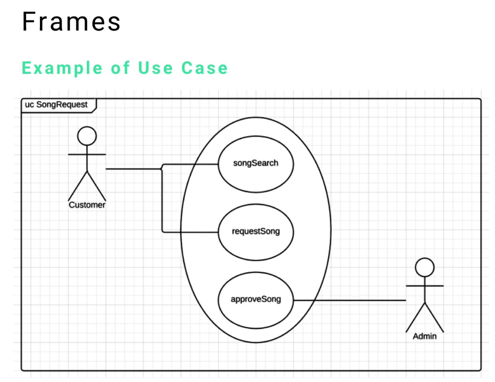
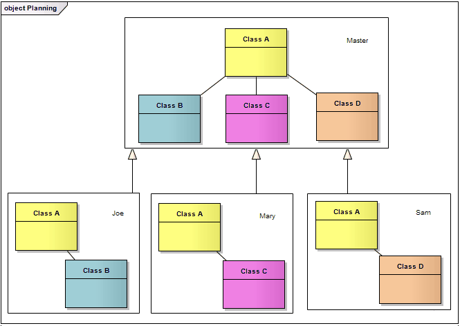
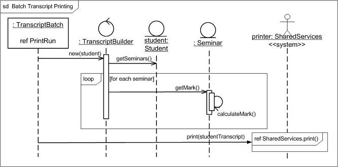

|Guía|Título|
|---|---|
|06-152|Introducción a los Componentes UML y Elementos Comunes|
|**06-153**|**Componentes Comunes de UML: Marcos (Frames)**|
|06-154|Componentes Comunes de UML: Clasificadores (Classifiers)|
|06-155|Componentes Comunes de UML: Estereotipos (Stereotypes)|
|06-156|Componentes Comunes de UML: Comentarios y Notas|
|06-157|Componentes Comunes de UML: Dependencias|
|06-158|Componentes Comunes de UML: Características y Propiedades|
|06-159|Cuestionario: Introducción a UML|

---

# 06-153: MARCOS (FRAMES)

---

1. **Introducción a los Marcos**
    
    1. ¿Qué son los Marcos?
    2. Propósito y Beneficios

2. **Componentes y Estructura de los Marcos**
    
    1. Elementos del Encabezado del Marco
    2. Límites de Encapsulación

3. **Convenciones de Nomenclatura Estandarizada**
    
    1. Mapeos Oficiales de Marcos UML
    2. Identificadores de Tipos de Diagrama

4. **Implementación en Diferentes Tipos de Diagramas**
    
    1. Marcos de Diagramas de Casos de Uso
    2. Marcos de Diagramas de Clases
    3. Marcos de Diagramas de Actividad
    4. Marcos de Diagramas de Secuencia

5. **Aplicación Práctica**
    
    1. Gestión de Sistemas Grandes
    2. Beneficios de Colaboración en Equipo

6. **Pautas de Diseño de Marcos**
    
7. **Mejores Prácticas - Consejos**
    

---


## ***1. Introducción a los Marcos***
---
## Qué son los MARCOS

Los marcos en UML son **contenedores de encapsulación** que proporcionan límites contextuales alrededor de elementos de diagrama.

Un marco **sirve como:**

- #### Contenedor encapsulado ...
    
- ####     ... que Organizada Visualmente ...
    
- ####         ... dentro de sus límites definidos ...
    
- ####             ... usando encabezados descriptivos
    



Los marcos, como **contenedores etiquetados** que contienen los diagramas UML, son similares a como podrías etiquetar carpetas de archivos en un archivador.

Así como una carpeta etiquetada te ayuda a **identificar rápidamente su contenido sin abrirla**, los marcos te ayudan a entender instantáneamente qué tipo de diagrama estás viendo y qué sistema o módulo representa.

## Propósito


### Funciones Principales

- **Reconocimiento Instantáneo**: Identificar rápidamente tipos de diagrama sin análisis detallado
- **Aporta Contexto**: Entender qué sistema o módulo representa el diagrama
- **Organización Profesional**: Mantener estándares consistentes de documentación
- **Comunicación en Equipo**: Facilitar entendimiento claro entre miembros del equipo

## Beneficios

1. **Carga Cognitiva Reducida**: No hay necesidad de analizar contenido del diagrama para entender su tipo
2. **Navegación Mejorada**: Fácil ubicación de diagramas específicos en conjuntos grandes de documentación
3. **Estandarización**: Enfoque consistente a través de toda la documentación del proyecto
4. **Presentación Profesional**: Apariencia limpia y organizada para presentaciones a stakeholders

---

## 2. Componentes y Estructura de los Marcos
---
### _Elementos del Encabezado del Marco_

Cada marco UML consiste en **DOS** componentes esenciales:


#### Borde

- Un límite rectangular que encapsula todo el diagrama
- Delimita claramente lo que pertenece a este modelo específico
- Proporciona separación visual de otros elementos de documentación

#### Encabezado (Etiqueta de Identificación)

Ubicado en la **esquina superior izquierda**, el encabezado contiene:

- **Abreviación del Tipo de Diagrama**: Código estandarizado que identifica el tipo de diagrama UML

- **Nombre/Título del Diagrama**: Nombre descriptivo que indica el sistema o módulo específico

- **Información Adicional Opcional**: Números de versión, fechas, u otros metadatos

### _**Sintaxis Estándar del Encabezado del Marco**_

```
[TipoDeDiagrama] NombreDiagrama [InfoOpcional]
```

```
UC SolicitudCancion v1.2
```

- `UC` = Diagrama de Casos de Uso
- `SolicitudCancion` = Nombre del Módulo/Sistema
- `v1.2` = Versión (opcional)

---


## **3. Convenciones de Nomenclatura Estandarizada**
---

### _Abreviaciones_

La especificación UML proporciona **abreviaciones estandarizadas para encabezados**:

| Tipo de Diagrama         | Abreviación  | Nombre Completo                  |
| ------------------------ | ------------ | -------------------------------- |
| **Actividad**            | `act`        | Diagrama de Actividad            |
| **Clases**               | `class`      | Diagrama de Clases               |
| **Comunicación**         | `comm`       | Diagrama de Comunicación         |
| **Componentes**          | `comp`       | Diagrama de Componentes          |
| **Despliegue**           | `depl`       | Diagrama de Despliegue           |
| **Vista de Interacción** | `io`         | Diagrama de Vista de Interacción |
| **Objetos**              | `obj`        | Diagrama de Objetos              |
| **Paquetes**             | `pkg`        | Diagrama de Paquetes             |
| **Perfil**               | `profile`    | Diagrama de Perfil               |
| **Secuencia**            | `seq` / `sd` | Diagrama de Secuencia            |
| **Máquina de Estados**   | `stm`        | Diagrama de Máquina de Estados   |
| **Tiempo**               | `tim`        | Diagrama de Tiempo               |
| **Casos de Uso**         | `uc`         | Diagrama de Casos de Uso         |

---

### _Buenas Prácticas de Nomenclatura_

#### Para Nombres de Sistema

- Usa **PascalCase** para nombres de múltiples palabras: `GestionUsuarios`, `ProcesadorPagos`
- Mantén nombres **concisos pero descriptivos**: `SistemaOrdenes` en lugar de `SistemaGestionOrdenesEnLinea`
- Usa **terminología consistente** a través de todos los diagramas

#### Ejemplos Completos

```
uc AutenticacionUsuario

class ProcesadorPagos

act CumplimientoOrdenes

seq ConexionBaseDatos

stm CarritoCompras

depl AmbienteProduccion
```

---

## 4. Implementación en Diferentes Tipos de Diagramas

---

### _Marcos en Diagramas de Casos de Uso_

#### **Propósito**

Identificar actores y sus interacciones con funcionalidad del sistema

#### **Ejemplo de Marco**


#### **Cuándo Usar**

- Planificación de requerimientos de interacción de usuario
- Documentación de límites del sistema y actores externos
- Comunicación de funcionalidad a stakeholders no técnicos

---

### _**Marcos en Diagramas de Clases**_

#### **Propósito**

Documentar estructura de objetos y relaciones

#### **Ejemplo de Marco**



#### **Cuándo Usar**

- Diseño y modelado de base de datos
- Arquitectura de sistema orientado a objetos
- Planificación de generación de código

---

### _Marcos en Diagramas de Actividad_

#### **Propósito**

Mapear procesos de negocio y lógica de flujo de trabajo

#### **Ejemplo de Marco**


#### **Cuándo Usar**

- Documentación de procesos de negocio
- Optimización de flujo de trabajo
- Modelado de comportamiento del sistema

---

### _Marcos en Diagramas de Secuencia_

#### **Propósito**

Documentar flujo de mensajes entre componentes del sistema

#### **Ejemplo de Marco**

Nota que también se utiliza la abreviación `sd`:



#### **Cuándo Usar**

- Diseño y documentación de API
- Planificación de integración de sistemas
- Debugging de interacciones complejas

---


## 5. Aplicación Práctica
---

### _Gestión de Sistemas Grandes_

#### Desafío: Sobrecarga de Documentación

En sistemas empresariales, podrías tener **50+ diagramas UML** a través de múltiples módulos.

Sin marcos, encontrar el diagrama correcto se convierte en una búsqueda que consume tiempo.

#### Solución: Uso Sistemático de Marcos

```
uc PortalCliente_Autenticacion
uc PortalCliente_Dashboard
uc PortalCliente_Facturacion

class PortalCliente_ModeloUsuario
class PortalCliente_ModeloPago
class PortalCliente_ModeloReporte

seq PortalCliente_FlujoLogin
seq PortalCliente_FlujoPago
seq PortalCliente_GeneracionReporte
```

>**Resultado** -> Reconocimiento instantáneo y agrupación lógica de diagramas relacionados.

---

### _Beneficios de Colaboración en Equipo_

#### Escenario: Incorporación de Nuevo Miembro del Equipo

Cuando un nuevo desarrollador se une a un equipo:

#### 😫 **Sin Marcos**

- Debe analizar cada diagrama para entender su propósito
- Confusión sobre qué diagramas se relacionan con qué módulos
- Tiempo perdido en reuniones de aclaración

#### 🗿 **Con Marcos**

- Entendimiento inmediato de tipos de diagrama y alcance
- Límites claros de módulos y relaciones
- Arquitectura de sistema autodocumentada

#### Comunicación Entre Equipos

- **Analistas de Negocios** pueden identificar rápidamente diagramas de casos de uso (`uc`).
- **Arquitectos de Base de Datos** pueden enfocarse en diagramas de clases (`class`).
- **Administradores de Sistemas** pueden localizar diagramas de despliegue (`depl`)

---


# 6. Pautas de Diseño de Marcos
---

| Aspecto        | Pauta                  | Propósito          |
| -------------- | ---------------------- | ------------------ |
| **Padding**    | 10-15px mínimo         | Claridad visual    |
| **Encabezado** | Posición superior-izq  | Estándar UML       |
| **Contenido**  | Unidad lógica singular | Organización clara |
| **Límites**    | Sin solapamiento       | Separación limpia  |

## ➜ Principios de Diseño Visual
---

### ➡️ _**Dimensionamiento de Marcos**_

##### **Padding Mínimo**

- Deja al menos 10-15 píxeles entre el borde del marco y el contenido del diagrama
- Asegura espacio visual respiratorio y apariencia profesional

##### **Escalado Proporcional**

- El marco debe escalar con la complejidad del diagrama
- Diagramas más complejos requieren marcos más grandes para claridad

##### **Márgenes Consistentes**

- Mantén espaciado uniforme a través de todos los diagramas
- Crea suite de documentación cohesiva

---

### ➡️ _**Posicionamiento del Encabezado**_

##### **Siempre Superior-Izquierda**

- Convención estándar UML para encabezados de marcos
- Asegura ubicación predecible de información

##### **Fuente Clara**

- Usa tipografía legible, típicamente igual que el texto del diagrama
- Mantiene consistencia visual a través de la documentación

##### **Tamaño Apropiado**

- El encabezado debe ser prominente pero no abrumador
- Balancea visibilidad con optimización de espacio de contenido

---

## ➜ Organización de Contenido

---

### ➡️ _**Qué va Dentro de los Marcos**_

#### ✅ **INCLUIR**

- Todos los elementos primarios del diagrama
- Anotaciones y notas relacionadas
- Información de leyenda o clave específica para este diagrama

#### ❌ **EVITAR**

- Información general del proyecto (usa bloques de título separados)
- Elementos de diagrama no relacionados
- Espacio en blanco excesivo que no sirve a la legibilidad

---

### ➡️ _**Límites del Marco**_

##### 🗿 **Un Propósito por Marco**

- Cada marco debe representar una sola unidad lógica
- Mantiene separación clara de responsabilidades

##### 🗿 **Alcance Claro**

- Todo dentro del marco debe relacionarse con el sistema/módulo nombrado
- Previene confusión sobre relaciones de elementos

##### 🗿 **Sin Solapamiento**

- Los marcos no deben contener elementos de otras unidades lógicas
- Asegura límites arquitectónicos limpios

---

## 7. 🗿 Mejores Prácticas - Más Consejos

---

### _**Lista de Verificación de Implementación**_
---
#### **Antes de Crear Diagramas:**

- [ ] Establecer convenciones de nomenclatura para tu proyecto
- [ ] Crear plantillas de encabezados de marco
- [ ] Definir tamaños estándar de marco para diferentes tipos de diagrama

---
#### **Durante la Creación de Diagramas:**

- [ ] Agregar marco inmediatamente después de crear nuevo diagrama
- [ ] Usar abreviación apropiada de tipo de diagrama
- [ ] Incluir nombre de sistema/módulo descriptivo pero conciso
- [ ] Asegurar que todo contenido relevante quepa dentro de límites del marco

---
#### **Checks de  Calidad:**

- [ ] Verificar que encabezados de marco coincidan con contenido del diagrama
- [ ] Revisar consistencia a través de todos los diagramas del proyecto
- [ ] Revisar nomenclatura de marcos con miembros del equipo
- [ ] Actualizar marcos cuando cambie el alcance del diagrama

---

### _**Estándares Profesionales**_

1. **La Consistencia es la norma**: Usa el mismo estilo de marco a través de toda la documentación del proyecto
    
2. **Nombres Significativos**: Los títulos de marcos deben transmitir inmediatamente el propósito del diagrama
    
3. **Control de Versiones**: Incluye información de versión en marcos cuando documentes sistemas en evolución
    
4. **Actualizaciones Regulares**: Mantén la información del marco actualizada conforme los sistemas cambien
    

---

### _**Errores Comunes**_

❌ **Abreviaciones Inconsistentes**: Mezclar `UC` y `CasoUso` en diferentes diagramas

❌ **Nombres Demasiado Largos**: `uc SistemaCompletoAutenticacionYAutorizacionUsuario`

❌ **Ausencia de Marcos**: Tener algunos diagramas con marcos y otros sin ellos

❌ **Tipos de Diagrama Incorrectos**: Usar abreviación `class` para un diagrama de actividad

---

### _**Más Consejos**_

🗿 **Plantillas de Marcos**: Crea plantillas de marco reutilizables en tu herramienta UML

🗿 **Codificación por Color**: Usa colores de fondo sutiles para distinguir tipos de diagrama

🗿 **Sistemas Anidados**: Para sistemas complejos, usa nomenclatura jerárquica como `PortalCliente_Auth_FlujoLogin`

🗿 **Integración de Documentación**: Asegura que nombres de marcos coincidan con secciones de documentación técnica correspondientes